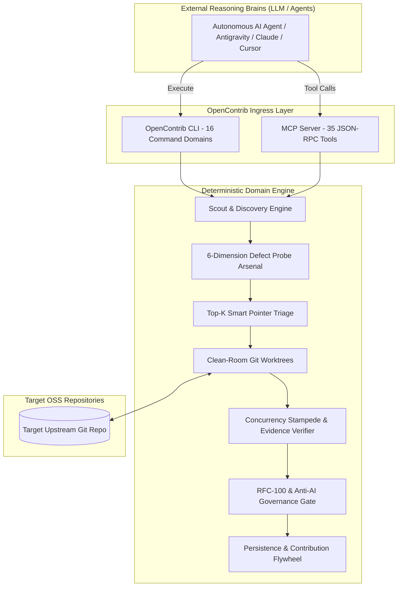

# 🏗️ OpenContrib Architecture Blueprint

<p align="center">
  <b>English | <a href="./ARCHITECTURE_zh.md">简体中文</a></b>
</p>

This document outlines the architectural principles, domain engines, and deterministic verification pipelines powering **OpenContrib**.



---

## 🧩 1. The 6-Dimension Defect Probe Arsenal

Traditional AI coding assistants rely on naive regex or blind file reading. OpenContrib executes **6 orthogonal static & dynamic defect probes**:

1. **AST Pattern Matching (`ast-grep`)**: Structural queries targeting cross-language anti-patterns (e.g. unchecked error returns, unclosed file descriptors, floating-point timeout comparisons).
2. **Type Invariant & Nil Pointer Dereference Probes**: Inter-procedural flow analysis to detect unsafe optional unwrapping and unhandled nil pointers.
3. **Concurrency Contention & Mutex Race Probes**: Lock acquisition order verification, deferred cleanup strong-reference retention, and race window detectors.
4. **Boundary & Overflow Probes**: Integer boundary overflows, off-by-one slice dereferencing, and non-finite numeric values (`NaN`, `+Inf`).
5. **Cross-Platform Path & CRLF Compatibility Probes**: Path separator normalization, case sensitivity on Windows/macOS/Linux, and CRLF diff parsing safety.
6. **Resource Lifecycle & Leak Probes**: Goroutine / Task leaks, unjoined background compression routines, and orphaned temp directories.

---

## 🎯 2. Top-K Smart Pointer Triage & 1-Click Dereferencing

To eliminate context bloating and hallucinated multi-file guessing:

- OpenContrib computes a normalized **Suspiciousness Index** across identified defect sites.
- It returns a high-precision **Smart Pointer** `(file, startLine, endLine, confidence, probeType)` with an upper bound of 150 tokens.
- Agents can dereference only the exact 150-token slice needed, preserving 95% of the LLM context window.

---

## 🧪 3. Dual-Stage Verification & Concurrency Stampede

A patch is never submitted based on LLM "confidence". It must pass two deterministic gates:

1. **Stage 1: Clean-Room Reproduction**:
   - Spawns an isolated Git Worktree.
   - Executes the targeted unit test to establish baseline reproduction without polluting developer workspace.
2. **Stage 2: Concurrency Stampede & Chaos Jitter**:
   - Executes high-load parallel execution loops with random thread scheduling jitter.
   - Proves zero race conditions under lock contention.

---

## 🛡️ 4. Anti-Bandwagoning Governance (RFC-100 Gate & Hard Barrier)

To defend maintainer trust:

- **100-Line Patch Ceiling**: Automatically rejects massive refactors or unrequested reformatting.
- **Anti-AI Jargon Sanitizer**: Strips robotic explanations, emojis, and unverified speculative claims from PR drafts.
- **Exclusive Claim Protocol**: Verifies whether an issue is already claimed or actively worked on before drafting.
- **Exit Code 2 Hard Gate**: Failing quality checks physically terminate the CLI process, blocking non-compliant PRs.

---

## ⚡ 5. Active Session Engine & Deterministic State Machine

To guarantee unbroken traceability across multi-turn agent lifecycles:

- **Active Session Bus (`~/.opencontrib/active_session.json`)**: Tracks active `runId`, repository, workspace directory, and current phase.
- **Automatic Context Inheritance**: Subsequent CLI commands resolve `runId` and workspace automatically, persisting an append-only JSONL event log (`events.jsonl`) and real-time evidence (`evidence.json`).
- **Self-Guiding Next Actions**: Each CLI response outputs deterministic next-step recommendations and human review checkpoints.

---

## 🔒 6. Telemetry & Privacy

OpenContrib includes a minimal, anonymous ping mechanism to understand runtime adoption.

- **Strictly Non-Sensitive**: Transmits only OS platform, runtime (`node`/`bun`), and CLI version.
- **Opt-Out**: Users can completely disable telemetry anytime:

  ```bash
  export OPENCONTRIB_TELEMETRY=0
  # or
  export DO_NOT_TRACK=1
  ```

---

<sub>© 2026 OpenContrib Contributors. Licensed under the [MIT License](LICENSE).</sub>
