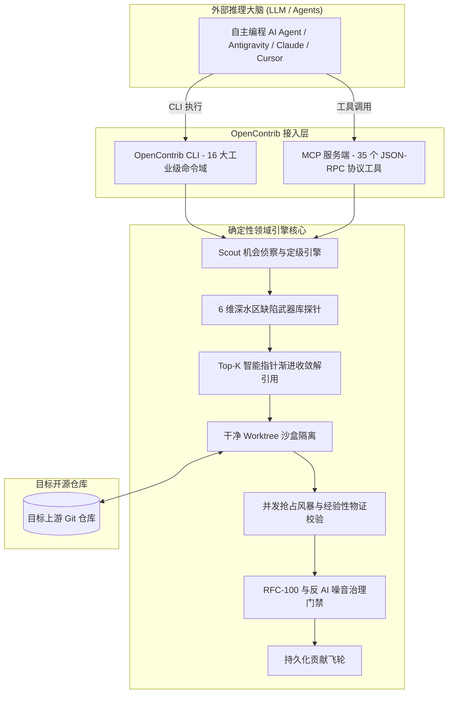

# 🏗️ OpenContrib 架构设计与工程推演蓝图

  <b><a href="./ARCHITECTURE.md">English</a> | 简体中文</b>

本文档阐述 **OpenContrib** 专为自主编程 AI Agent 打造的确定性开源贡献工业级引擎的分层架构与核心算法机制。

---

## 🧩 1. 6 维深水区缺陷探针武器库

传统 AI 编码助手依赖脆弱的正则或盲目全文扫描。OpenContrib 提供 **6 维正交的静态与动态深度缺陷探针**：

1. **AST 结构模式匹配 (`ast-grep`)**：跨语言结构化反模式嗅探（未处理的错误返回、未关闭的文件句柄、浮点超时比较等）。
2. **类型不变量与空指针探针**：跨过程流分析，捕获不安全的解包与未捕获的空指针异常。
3. **并发抢占与锁竞态探针**：加锁顺序检测、异步清理强引用持有验证与竞态时间窗口探查。
4. **数值边界与溢出探针**：整型边界溢出、切片越界以及非有限浮点数（`NaN`, `+Inf`）防御。
5. **跨平台路径与 CRLF 兼容探针**：路径分隔符标准化、大小写敏感性与 Windows/Linux/macOS 换行差异。
6. **资源生命周期与泄漏探针**：Goroutine/协程泄漏、未等待的后台压缩任务以及孤儿临时文件。

---

## 🎯 2. Top-K 智能指针收敛与 150-Token 渐进式解引用

为了彻底解决长上下文污染与大模型盲目猜代码的问题：

- OpenContrib 在缺陷点计算标准化的 **可疑度指数 (Suspiciousness Index)**。
- 输出仅占 150 Token 的高精度 **Smart Pointer** `(file, startLine, endLine, confidence, probeType)`。
- Agent 仅在需要时一键解引用 150 Token 的精准切片，节省 95% 的上下文开销。

---

## 🧪 3. 双阶段物证校验与并发抢占风暴

补丁绝不依赖大模型“自称的信心”，必须通过双重经验性物理验证：

1. **阶段一：干净 Worktree 沙盒复现**：在隔离的工作树中执行定向单元测试建立基线，绝不污染工作区。
2. **阶段二：并发抢占风暴与混沌抖动**：高并发并行执行与线程随机调度抖动，验证多线程竞态安全。

---

## 🛡️ 4. 防跟风抢占治理与 RFC-100 刚性门禁

坚决捍卫开源社区维护者的信任：

- **100 行 Diff 上限**：自动拦截大范围重构与无关格式化。
- **反 AI 行话过滤**：自动剥除机械式空话、Emoji 堆砌和无依据的主观推断。
- **排他性认领协议**：发 PR 前严格校验 Issue 是否已被其他开发者锁定。
- **Exit Code 2 刚性阻断**：未达质量标杆（总分 $<90\%$ 或单项 $<80\%$）时直接退出并阻断提 PR 通道。

---

## ⚡ 5. 活跃会话引擎与自驱状态机 (Active Session Engine)

确保跨多轮对话与命令执行时上下文零丢失：

- **全局活跃会话总线 (`~/.opencontrib/active_session.json`)**：实时同步记录当前 `runId`、关联仓库、沙盒路径与生命周期阶段。
- **上下文自动继承**：后续所有 CLI 命令免传参数自动寻址工作区与活跃会话，追加写入只增事件流（`events.jsonl`）与物证快照（`evidence.json`）。
- **保姆级自驱指令推荐**：终端每步输出确切的 `▶ NEXT RECOMMENDED COMMAND`，驱动智能体精准流转。

---

© 2026 OpenContrib 贡献者。遵循 [MIT License](LICENSE) 协议。
