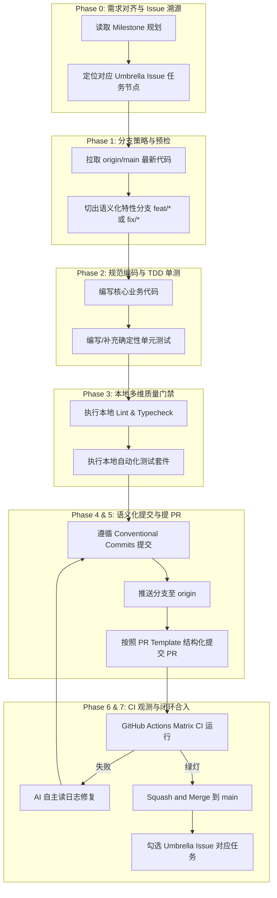

# 🚀 Agent 自动化日常开发与 PR 闭环标准作业程序 (SOP)
> **Agentic Development & PR Closed-Loop Standard Operating Procedure**  
> **适用对象**：Google Antigravity, Claude Code, Cursor Composer, Aider, GitHub Copilot Agent 等自主编程智能体  
> **版本**：v1.0.0 · 工业级开源工程规范

---

## 🧭 一、 核心工程哲学与红线准则

为保证项目代码库达到全球顶级开源维护者（如 `antfu`、`chaojixinren`）的工业级交付标准，任何承接本工程任务的 AI Agent 必须无条件遵循以下**五大铁律**：

1. **🚫 严禁直推主干**：严禁在 `main` 分支直接执行 `commit` 或 `push`，所有变更必须通过 `feature/*` 或 `fix/*` 分支以 Pull Request 形式合入。
2. **🧪 零退化与单测先行**：任何代码变更（无论是新特性还是 Bug 修复）必须伴随确定性的单元测试（Unit Test），确保新代码覆盖率且既有测试 100% 通过。
3. **🎯 Diff 聚焦与原子化**：单个 PR 只解决一个核心关切点（Single Concern），避免跨模块或包含无关的格式化噪点，代码修改量建议控制在 **100 ~ 300 行**。
4. **📝 Conventional Commits 规范**：提交信息必须严格遵循语义化规范（`feat:`, `fix:`, `docs:`, `chore:`, `refactor:`），杜绝无意义提交。
5. **🔄 溯源与闭环追踪**：开发必须绑定对应的 **GitHub Milestone** 与 **Umbrella Issue**，并在合入后同步勾选闭环。

---

## 🔄 二、 标准 7 步开发与 PR 闭环全流程



---

## 🛠️ 三、 详细阶段执行指南与操作指令

### Phase 0: 需求对齐与任务溯源 (Triage)
1. **确认目标里程碑**：
   * 检查目标仓库的 GitHub Milestones（如 `M1: Core Architecture`, `M2: Domain Primitives`, `M3: Dashboard`）。
2. **确认关联合约**：
   * 找到对应 Milestone 下的 **Umbrella Issue**，明确本次任务的具体子项。

---

### Phase 1: 分支策略与环境预检 (Branching)
```bash
# 1. 确保工作区干净并同步主干
git checkout main
git pull origin main

# 2. 从 main 检出符合命名规范的特性分支
# 规则: feat/<scope>-<short-description> 或 fix/<scope>-<short-description>
git checkout -b feat/mcp-domain-primitives
```

---

### Phase 2: 规范驱动编码与单测先行 (Implementation & Tests)
* **Bug 修复标准（Fail-First）**：
  1. 先编写一个针对该 Bug 的单元测试，运行确认其**失败（Fail）**。
  2. 编写修复代码，再次运行确认该测试**通过（Pass）**。
* **特性开发标准**：
  1. 接口与核心逻辑必须有对应的单元测试覆盖（边界值、空值、异常处理）。
  2. 纯函数测试严禁依赖不稳定的外部网络与未打桩的第三方接口。

---

### Phase 3: 本地多维质量门禁 (Local Quality Gate)
提交代码前，AI 必须在当前仓库运行对应的全量质量门禁命令，确保 **0 Error、0 Warning**：

| 技术栈 / 仓库 | 质量门禁执行命令 | 通过标准 |
| :--- | :--- | :--- |
| **Bun / TypeScript** (`opencontrib`) | `bun run lint && bun test` | 0 类型错误，测试用例 100% Pass |
| **Next.js / React** (`mystic`, `youju`) | `npm run lint && npm test && npm run build` | 静态检查通过，构建顺利生成产物 |
| **Golang** (`tiktok-backend-go`) | `go vet ./... && go test -v -race ./...` | 无内存竞态警告，单测全部通过 |
| **Java 21 / Spring Boot** (`ningxiangshop`) | `mvn clean test` | 编译 0 警告，单元测试 100% Pass |

---

### Phase 4: Conventional Commits 语义化提交 (Commit Hygiene)
```bash
# 暂存目标文件（严禁暂存 .env, node_modules, 编译临时文件）
git add <target-files>

# 格式：<type>(<scope>): <short description>
git commit -m "feat(mcp): implement 18 atomic domain primitives for agent workflows"
# 或
git commit -m "fix(diff): resolve CRLF line ending corruption in unified patch parser"
```

#### 常用提交类型标识：
* `feat`: 新增功能、接口或工具
* `fix`: 修复 Bug 或异常行为
* `docs`: 文档、注释或规范调整
* `chore`: 构建配置、依赖项更新或辅助工具调整
* `refactor`: 重构代码（不改变既有功能与接口）
* `test`: 新增或重构测试套件

---

### Phase 5: Pull Request 提报规范 (PR Creation)
```bash
# 推送特性分支到远端
git push origin feat/mcp-domain-primitives
```

在 GitHub 创建 PR 时，必须严格按照项目 `.github/pull_request_template.md` 输出，内容范例如下：

```markdown
## 🎯 Description / Summary
- 在 `packages/mcp` 中实现了 18 个原子领域工具与 3 个运行时资源。
- 完善了基于 stdio 与 SSE 协议的握手及参数强类型校验。

## 🔍 Root Cause / Architecture Rationale
- 解决 Agent 过去直接操作本地裸 Git 容易出现凭据外泄与环境漂移的问题。
- 提供结构化 MCP 契约，保证自治代理执行的确定性。

## 🧪 Verification & Empirical Evidence
- [x] 新增单测覆盖 18 个 Primitives 调用链路
- [x] 本地全量质量门禁验证通过：

```bash
$ bun test test/mcp.test.ts
✓ MCP server initialize > stdio handshake [12ms]
✓ MCP tool execution > contrib_scout [45ms]
✓ MCP resource read > workspace://status [8ms]

18 pass, 0 fail
```

## 📋 PR Quality Checklist
- [x] 遵循 Conventional Commits 规范
- [x] 关联 Umbrella Issue #2
```

---

### Phase 6: CI 观测与自我修复循环 (CI Watchdog)
1. PR 提交后，GitHub Actions 会自动触发跨平台 Matrix CI 流水线。
2. **AI 自我修复机制**：
   * 若 CI 出现红色失败，AI 必须调取 CI 日志分析根因（如 Windows 跨平台路径斜杠问题、Node 版本兼容性等）。
   * 在本地针对性修复并追加 commit 推送，直至所有 CI Checks 全部转为**绿色 Pass**。

---

### Phase 7: Squash Merge 与状态闭环 (Merge & Closure)
1. **合并策略**：在所有门禁通过后，执行 **`Squash and merge`**，生成整洁的主干提交历史。
2. **分支清理**：合并完成后，自动删除已合入的临时特性分支。
3. **闭环更新**：打开对应的 **Umbrella Issue**，将该 PR 对应的任务勾选为已完成（如 `- [x] 18 atomic domain primitives`）。

---

## 🤖 四、 “一键启动开发” AI Prompt 模板

当你需要指派 AI 智能体开发新功能或修复缺陷时，直接将以下 Prompt 复制给 AI：

```text
你现在是当前项目的核心开源维护者。请严格遵守本仓库根目录下的《AGENT_DEVELOPMENT_PR_SOP.md》执行以下任务：

【任务目标】
请阅读当前的 GitHub Milestone 与 Umbrella Issue，实现/修复以下内容：
<在这里填写具体的业务需求或 Bug 描述>

【执行铁律】
1. 严禁直接在 main 分支修改或提交代码！必须先从 origin/main 检出符合规范的 feature/ 或 fix/ 分支。
2. 践行 TDD：编写功能代码的同时必须附带确定性的单元测试，确保无既有功能退化。
3. 本地必须运行全量门禁命令（Lint + Typecheck + Test），确认 0 Error、0 Warning。
4. 采用 Conventional Commits 规范提交代码。
5. 推送分支并按照仓库 pull_request_template.md 格式输出结构化 PR 内容（附带本地通过的测试命令行输出）。
6. 合并后同步更新对应 Umbrella Issue 的任务勾选状态。
```

---

## 🚫 五、 反模式与绝对禁令清单 (Anti-Patterns)

| 禁令行为 | 危害 | 正确做法 |
| :--- | :--- | :--- |
| **直接 push 到 main** | 破坏主干稳定性，绕过 CI 门禁 | 从 main 切新分支，走完整 PR 流程 |
| **无单元测试合并** | 导致后续迭代出现隐藏回归退化 | 必须附带单测验证逻辑正确性 |
| **巨型单次 Commit** | 难以 Code Review 与 Git Bisect 定位 | 拆解为原子化提交，小步快跑 |
| **混入格式化噪点** | 污染 Git Blame，增加审查心智负担 | 仅修改核心逻辑行，不随意大面积重排版 |
| **AI 臆测外部 API** | 产生幻觉导致运行时崩溃 | 优先查阅官方文档与类型定义，本地实跑验证 |
| **低信噪比刷分 PR** | 触发 ghfind/社区反作弊告警与封禁 | 聚焦深水区八大高价值缺陷 |

---

## 🌊 六、 八大深水区高价值缺陷雷达 (Deep-Water Defect Radar)

Agent 在进行开源问题挖掘或自身架构审计时，优先识别并锁定以下 8 类深水区缺陷：

| 序号 | 缺陷维度 | 核心隐患场景与识别特征 | 业界/上游典型范式 |
| :---: | :--- | :--- | :--- |
| **1** | **协议与序列化契约漂移** | `falsy value` / `0` / `false` 在 `omitempty` 下被吃掉导致下游缓存穿透或配置失效；HTTP/2 Header 大小写不兼容；SSE 截断。 | ByteDance `flowgram.ai#1161` |
| **2** | **生命周期与资源泄露** | 向注册中心（ZK/Nacos）注册 Watcher 在重连时未注销导致翻倍膨胀；Context Cancellation 未传播产生僵尸协程；未关闭文件句柄 `lsof` 泄漏。 | Apache `dubbo-go#3635` |
| **3** | **分布式缓存与一致性** | Falsy Value 缓存击穿；乱序双写导致的 Cache Stampede；重试幂等性被打破。 | 分布式 L2 缓存 / 幂等扣减 |
| **4** | **内存布局与底层 ABI** | PyTorch/vLLM/CUDA 中非连续 Tensor (`permute`/`transpose`) 传入 C++/CUDA Kernel 导致段错误 (Segfault)；FFI 跨语言悬垂指针。 | vLLM `vllm-project/vllm#50748` |
| **5** | **性能坍塌与反压失效** | ReDoS 正则灾难性回溯导致单核卡死；缺乏 Full Jitter 指数退避引发雷鸣群涌 (Thundering Herd)；背压丢失导致内存 OOM。 | 高并发网关 / 正则路由 |
| **6** | **时间单调性与时钟回拨** | Wall Clock 计算耗时在 NTP 校时下出现负数；夏令时 (DST) / 闰秒导致调度任务跨日跳过或重复执行。 | 定时调度系统 / 指标采集器 |
| **7** | **编译器优化假设破坏** | 高频热路径参数使用 `interface{}` 破坏逃逸分析导致栈上分配失效；GC STW 停顿从 1ms 飙升至 50ms。 | 高性能 RPC / 序列化框架 |
| **8** | **数值边界与跨平台破坏** | `NaN`/`+Inf` 超时挂起（ByteDance `deer-flow`）；Windows/Linux CRLF 换行符与 `filepath.ToSlash` 路径遍历（Alibaba `open-code-review`）。 | ByteDance `deer-flow#4823` |

