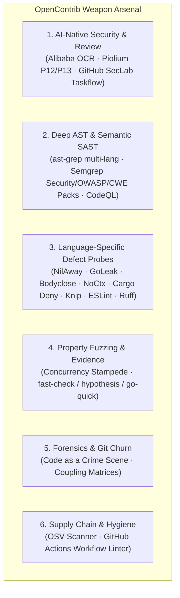

<div align="center">

# 🚀 OpenContrib

**The Agent-Native Open Source Contribution Engine**

[](https://opensource.org/licenses/MIT)
[](https://bun.sh)
[](https://www.typescriptlang.org/)
[](https://github.com/MeiSiristhebest/opencontrib)
[](https://github.com/MeiSiristhebest/opencontrib#command-map)
[](https://www.npmjs.com/package/opencontrib-cli)
[](#)

<p align="center">
  <b>A production-grade contribution infrastructure providing autonomous AI coding agents with discrete, composable domain capabilities: 6-dimension probe weapon arsenal, Smart Pointer progressive dereferencing, isolated worktree sandboxes, concurrency stampede evidence verification, anti-AI governance, structured run persistence, and a profile flywheel.</b>
</p>

</div>

---

## 💡 What is OpenContrib?

OpenContrib is a **Contribution Engine**, not a monolithic reasoning bot. It does not attempt to replace Claude Code, Cursor, Codex, Devin, or Google Antigravity. Instead, it equips reasoning agents with the structured engineering primitives and domain weapon arsenal required to discover, verify, remediate, and land high-impact open-source contributions.

```text
    ┌──────────────────────────────────────────────────────────────────┐
    │              External AI Agent (Brain / Reasoner)                │
    │    Google Antigravity · Claude Code · Cursor · Codex · Devin     │
    │                                                                  │
    │  Autonomous Reasoning · Decision Making · Code Writing            │
    └───────────────────────────┬──────────────────────────────────────┘
                                │ Shell / CLI calls
                                ▼
    ┌──────────────────────────────────────────────────────────────────┐
    │                  OpenContrib CLI (Tool Layer)                     │
    │                                                                  │
    │  probe · pointer · capability · evidence · workspace · plugin    │
    │  governance · discovery · run · flywheel · doctor                │
    └───────────────────────────┬──────────────────────────────────────┘
                                │ Pure TypeScript imports
                                ▼
    ┌──────────────────────────────────────────────────────────────────┐
    │                @opencontrib/core (Domain Logic)                   │
    │                                                                  │
    │  13 modules · 0 MCP dependencies · 0 CLI framework dependencies  │
    │  Probe · Sandbox · Evidence · Governance · Flywheel · Run        │
    │  Storage · GitHub · Risk · Orchestration · LLM · Memory · Kernel │
    └──────────────────────────────────────────────────────────────────┘
```

**Key Architectural Invariant**: `packages/core/` has zero dependencies on interface layers. The CLI (`opencontrib-cli`) is the primary, zero-friction interface. An MCP server wrapper (`opencontrib-mcp`) exists for compatibility with MCP-native environments.

---

## ⚡ Quick Start

### Install

```bash
# Global install via npm
npm install -g opencontrib-cli

# Verify environment & installed toolchains
opencontrib doctor --pretty
```

### Run from Source (Development)

```bash
git clone https://github.com/MeiSiristhebest/opencontrib.git
cd opencontrib
bun install
bun test            # 29 test suites, 134 tests, 908 assertions (100% pass)
bun x tsc --noEmit  # 0 type errors
```

---

## 🗺️ Command Map

24 subcommands across 10 core capability domains:

| Domain | Commands | Purpose |
| :--- | :--- | :--- |
| **Probe** | `probe run` `probe plan` `probe hotspot` `probe fuzz` | Top-K triaged multi-probe SAST, Git churn forensics, fuzz harness generation |
| **Pointer** | `pointer resolve` `pointer list` | 3-level progressive dereferencing (`ptr://...` $\rightarrow$ summary, slice, evidence) |
| **Capability** | `capability list` `capability route` `capability score` | Microkernel capability routing and multi-signal scoring |
| **Evidence** | `evidence` | Concurrency stampede chaos verification, jitter metrics, and dual-stage assertions |
| **Workspace** | `workspace prepare` `workspace purge` | Clean-room Git worktree sandbox creation and ephemeral cleanup |
| **Governance** | `governance audit` `governance impact` `governance ci-diagnose` `governance pr-template` | RFC-100 diff audit, anti-AI linting, sister-module variant check, native PR templates |
| **Discovery** | `scout` `discovery rank` `discovery qualify` `discovery feasibility` `discovery context` `discovery manifests` | Opportunity signals, anti-bandwagon qualification, context assembly |
| **Plugin** | `plugin list` `plugin add` `plugin remove` | Dynamic SAST & AST plugin lifecycle management |
| **Run** | `run create` `run get` `run resume` `run save` | Auditable session state tracking under `~/.opencontrib/runs/` |
| **Flywheel** | `flywheel sync` `flywheel pr-track` `doctor` | Profile persistence, maintainer trust flywheel, environment diagnostics |

---

## 🗡️ The 6-Dimension Weapon Arsenal

OpenContrib provides 6 specialized probe dimensions out-of-the-box:



### Top-K Smart Pointer Triage & 1-Click Resolution

When `opencontrib probe run` executes, it automatically weighs findings by `Severity x CategoryMultiplier x Confidence` and outputs **Top 5 actionable candidates** with ready-to-run dereferencing commands:

```bash
# Execute proactive scan with Top-K triage
opencontrib probe run ./target-repo --pretty

# Instant 150-token slice dereference (zero context pollution)
opencontrib pointer resolve ptr://findings/ast-ts-unhandled-promise-catch-foo-108 --view slice
```

---

## 🔄 Dual-Track Execution Routing

```text
Track A: Proactive 0-Day Scanner
  Multi-Probe Scan → Top-K Pointer Resolve → Clean-Room Worktree → Red PoC → Green Fix 
  → Concurrency Stampede Evidence → Sister-Module Variant Sweep → Issue-First → Merged PR

Track B: Reactive Issue Scout
  Scout Issues → Multi-Signal Rank → Anti-Bandwagon Qualify → Feasibility Assessment 
  → Context Assembly → Worktree Sandbox → Dual-Stage Evidence → Governance Audit → Merged PR
```

---

## 🛡️ The 5 Absolute Engineering Invariants

1. **Anti-Drift Circuit Breaker (Max 3 `view_file` calls)**:
   - Avoid blind sequential file reads (> 3 views). Pinpoint symbols strictly via Smart Pointer slices (`ptr://...`) or `grep_search`.
2. **Mandatory Issue-First on 0-Days (No Blind PRs)**:
   - For proactive 0-day discoveries, **ALWAYS create a GitHub Issue first** (`gh issue create --body-file ...`) with an authoritative Claim statement. PR descriptions **MUST anchor `Fixes #<id>`**.
3. **Targeted Subsystem Test Isolation (No Global Flaky Runs)**:
   - Never run broad root tests (`go test ./...` or `npm test` at repo root). Always scope test commands strictly to modified sub-packages.
4. **Anti-Deadlock Search Mandate**:
   - Every `rg` or `fd` command **MUST explicitly specify a target directory** (e.g. `rg "pattern" .`). Never omit target paths to prevent 30-minute stdin hangs.
5. **Local Markdown Files for GitHub CLI**:
   - Always write Issue and PR bodies to temporary `.md` files and pass `--body-file <file>` to avoid shell escaping errors.

---

## 📦 Monorepo Packages

| Package | npm | Description |
| :--- | :--- | :--- |
| `@opencontrib/core` | — | Pure domain logic — 13 modules, 29 test suites, 0 interface dependencies |
| `opencontrib-cli` | `npm install -g opencontrib-cli` | CLI interface — 24 subcommands via Commander.js |
| `opencontrib-mcp` | `npm install opencontrib-mcp` | MCP compatibility wrapper — 20 tools, 3 resources, 1 prompt |
| `opencontrib-studio`| — | Web visualization dashboard for contribution tracking |

---

## 📜 License

Distributed under the [MIT License](LICENSE). Copyright (c) 2026 OpenContrib Contributors.
