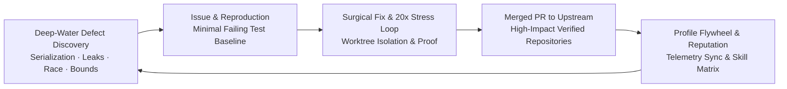

<div align="center">

# 🚀 OpenContrib

**The Agent-Native Open Source Contribution Engine — CLI & MCP Server**

[](https://opensource.org/licenses/MIT)
[](https://bun.sh)
[](https://www.typescriptlang.org/)
[](https://modelcontextprotocol.io)
[](https://github.com/MeiSiristhebest/opencontrib#cli-interface)
[](#)

<p align="center">
  <b>A composable contribution infrastructure providing autonomous Agents with discrete domain capabilities: Opportunity Signals, Worktree Isolation, Dual-Stage Evidence Verification, Anti-AI Governance, Run Persistence, and Profile Flywheel — available as both an MCP server and a lightweight CLI.</b>
</p>

</div>

---

## 🌟 Philosophy: Contribution Engine, Not Giant Agent

OpenContrib does **not** attempt to replace the external reasoning AI (Claude Code, Cursor, Codex, Devin, Antigravity). Instead, it follows a strict separation of concerns:

```text
                       External AI Agent (Brain)
        ┌───────────────────────────────────────────────────────┐
        │ Claude Code / Cursor / Codex / Devin / Antigravity    │
        └──────────────────────────┬────────────────────────────┘
                                   │
                   Autonomous Reasoning & Decisions
                                   │
                  ┌────────────────┴────────────────┐
                  │                                 │
            GitHub MCP         ┌─── OpenContrib ───┐
                  │            │  CLI   MCP   Core  │
       Native GitHub API State │  ◄────► ◄─────── │
  (Issues, PRs, Comments,      │  Sandbox, Evidence │
    Repo State)                │  Governance, Runs │
                               └──────────────────┘
```

- **External Agent**: Makes high-level decisions, reasons about code, and writes patches.
- **GitHub MCP**: Reads and mutates GitHub repository state.
- **OpenContrib CLI**: Zero-token overhead subcommand interface — human & AI agents alike.
- **OpenContrib MCP**: Same core, wrapped for MCP-native agents.
- **Core**: Pure TypeScript domain logic — no MCP, no CLI — reused by both.
- *(Internal Core retains a lightweight GitHub adapter strictly for standalone local workflow execution)*.

### Why CLI Instead of MCP?

| Dimension | MCP | CLI |
|-----------|-----|-----|
| **Context Token Cost** | 10,000+ tokens per session (all 18 tool schemas loaded) | 200-400 tokens per call (single subcommand help) |
| **Human Usability** | None | `--help` instantly usable |
| **Concurrency** | Single stdio connection, sequential | Multi-process, independent |
| **Debuggability** | Needs MCP client | `npx opencontrib doctor` runs anywhere |
| **Pipeline Friendliness** | JSON-RPC overhead | Native stdin/stdout piping |

The CLI is the **primary interface** — the MCP server is a compatibility wrapper over the same core.

---

## 📦 Monorepo Architecture

```
opencontrib/
├── packages/
│   ├── core/           # 🧠 Pure domain logic (13 modules, zero MCP/CLI deps)
│   ├── cli/            # 🖥️ 20 subcommands via Commander.js (npm: opencontrib-cli)
│   ├── mcp-server/     # 🔌 MCP wrapper (18 tools, 3 resources, 1 prompt)
│   └── studio/         # 🎨 Obsidian/Claude-themed Native Web Control Studio
├── skills/             # 📜 Master Open-Source Contributor Skill
└── package.json        # 🛠️ Root Monorepo configuration
```

> **Key property**: `packages/core/` has **zero** dependencies on MCP or CLI frameworks. Adding a new interface (gRPC, REST, TUI) only requires a new `packages/xxx/` that imports from `@opencontrib/core`.

---

## ⚡ Quick Start

```bash
# Clone the repository
git clone https://github.com/MeiSiristhebest/opencontrib.git
cd opencontrib

# Install dependencies via Bun
bun install

# Run full test suite (16 test suites, 78 tests)
bun test
```

---

## 🖥️ CLI Interface (20 Subcommands)

The CLI is the recommended way to interact with OpenContrib. It requires **zero token overhead** for help text and supports both interactive use and shell pipelines.

### Installation

```bash
# From npm (after publishing)
npm install -g opencontrib-cli

# Or run directly from source
cd opencontrib
bun run cli --help
```

### Quick Reference

```bash
# 1. Check environment health
opencontrib doctor

# 2. Discover opportunities
opencontrib scout facebook/react --tech-stack typescript,react --limit 5
opencontrib scout bytedance --focus bugfix,testing --min-stars 100

# 3. Assess a specific issue
opencontrib discovery feasibility --title "NPE in parser module" --labels bug,parser
cat issue-data.json | opencontrib discovery qualify
opencontrib discovery rank --input '{"issue":{...}, "repo":{...}}'

# 4. Assemble context and prepare workspace
cat context-input.json | opencontrib discovery context
opencontrib workspace prepare --repo microsoft/vscode --issue 12345
opencontrib workspace purge --clean-repos

# 5. Collect evidence
opencontrib evidence --cwd . --test-cmd "npm test" --assertion "expect.*toFail" --stress-loop 20

# 6. Audit and render
cat ci.log | opencontrib governance ci-diagnose
opencontrib governance audit --patch diff.txt --pr-title "Fix parser" --pr-body "..."
opencontrib governance pr-template --issue 42 --summary "Fixed null check" \
  --validation-cmd "npm test" --validation-output "5 tests passed" \
  --key-changes "fixed null check,added regression test"

# 7. Manage run sessions
opencontrib run create --repo facebook/react --issue 42 --title "fix NPE"
opencontrib run get run_20260819195606_a_b_issue_1_umpc
opencontrib run resume run_20260819195606_a_b_issue_1_umpc

# 8. Sync flywheel and track PRs
cat record.json | opencontrib flywheel sync --repo facebook/react
cat pr-data.json | opencontrib flywheel pr-track
```

### Command Map

| Category | CLI Command | MCP Tool |
|----------|------------|----------|
| **Run** | `run create` `run get` `run resume` `run save` | `contrib_create_run` `contrib_get_run` `contrib_resume_run` `contrib_save_artifact` |
| **Discovery** | `scout` `discovery rank` `discovery qualify` `discovery feasibility` `discovery context` `discovery manifests` | `contrib_scout` `contrib_rank_opportunity` `contrib_qualify_issue` `contrib_assess_feasibility` `contrib_assemble_context` `contrib_diagnose_manifests` |
| **Workspace** | `workspace prepare` `workspace purge` | `contrib_prepare_workspace` `contrib_purge_sandbox` |
| **Evidence** | `evidence` | `contrib_collect_evidence` |
| **Governance** | `governance audit` `governance impact` `governance ci-diagnose` `governance pr-template` | `contrib_audit_governance` `contrib_analyze_impact` `contrib_diagnose_ci` `contrib_render_pr_template` |
| **Flywheel** | `flywheel sync` `flywheel pr-track` `doctor` | `contrib_sync_flywheel` `contrib_track_pr_status` `contrib_doctor` |

### I/O Patterns

```bash
# Complex inputs via --input flag
opencontrib discovery rank --input '{"issue":{"number":1,"title":"..."},...}'

# Complex inputs via stdin (best for LLM pipelines)
cat payload.json | opencontrib discovery rank

# Log file inputs
opencontrib governance ci-diagnose --log-file build.log

# Pipeable compact output (no --pretty)
opencontrib scout facebook/react | jq '.opportunities[0].title'
```

---

## 🔌 Model Context Protocol (MCP) Setup

> **Note**: The MCP server exposes the same core logic as the CLI. If you're using a CLI-native agent or prefer shell scripts, use `opencontrib-cli` instead.

### ⚡ Option 1: One-Click Automatic Setup (Recommended)
Run the auto-installer to automatically detect and configure **Claude Desktop, Cursor, Windsurf, Antigravity, and VS Code / Cline**:

```bash
# Using NPX (Node.js)
npx -y opencontrib-mcp setup

# Or using Bun
bunx opencontrib-mcp setup
```

---

### 🛠️ Option 2: Manual Configuration (Universal `npx` / `bunx`)

No need to clone or hardcode local folder paths! Simply add OpenContrib to your MCP client config (`claude_desktop_config.json`, `~/.cursor/mcp.json`, or `antigravity.json`):

#### Standard Setup (Universal NPX):
```json
{
  "mcpServers": {
    "opencontrib": {
      "command": "npx",
      "args": ["-y", "opencontrib-mcp"]
    }
  }
}
```

#### Dual-MCP Setup (GitHub MCP + OpenContrib MCP):
```json
{
  "mcpServers": {
    "github": {
      "command": "npx",
      "args": ["-y", "@modelcontextprotocol/server-github"],
      "env": {
        "GITHUB_PERSONAL_ACCESS_TOKEN": "your_github_token_here"
      }
    },
    "opencontrib": {
      "command": "npx",
      "args": ["-y", "opencontrib-mcp"]
    }
  }
}
```

### Protocol Capabilities: 18 Tools, 3 Resources, 1 Prompt

| Category | Primitives | Description |
| :--- | :--- | :--- |
| **Run & Session** | `contrib_create_run`<br>`contrib_save_artifact`<br>`contrib_get_run`<br>`contrib_resume_run` | Structured session tracking under `~/.opencontrib/runs/<runId>/` with full crash resume. |
| **Discovery & Feasibility** | `contrib_scout`<br>`contrib_rank_opportunity`<br>`contrib_qualify_issue`<br>`contrib_assess_feasibility`<br>`contrib_diagnose_manifests` | Objective multi-dimensional probability signals (skill, OS feasibility, actionability) without prescribing decisions. |
| **Context & Workspace** | `contrib_assemble_context`<br>`contrib_prepare_workspace`<br>`contrib_purge_sandbox` | Problem skeleton + reading order + target tests + isolated Git worktree sandbox. |
| **Evidence & Governance** | `contrib_collect_evidence`<br>`contrib_audit_governance`<br>`contrib_render_pr_template` | Pre-fix failure assertion + post-fix 20x stress loop; 100-line gate + anti-AI audit. |
| **Flywheel & Lifecycle** | `contrib_sync_flywheel`<br>`contrib_track_pr_status`<br>`contrib_doctor` | Memory ledger, PR lifecycle tracking, and host environment diagnostic. |
| **Resources** | `opencontrib://doctor`<br>`opencontrib://memory`<br>`opencontrib://runs` | Zero-token instant context injection for host health, repo pitfalls, and run history. |
| **Prompts** | `opencontrib_workflow_guide` | Standard 9-step Phase-Gated execution protocol for autonomous Agents. |

---

## 🛡️ Core Verification & Governance Principles

1. **Credential-Isolated Local Execution Environment**: Test and benchmark execution runs with stripped credentials (`~/.ssh`, `~/.aws`, `~/.npmrc`, `GH_TOKEN` purged), redirected `HOME`/`TMPDIR`, and restricted working-directory boundaries.
2. **Dual-Stage Empirical Verification**: Contributions require capturing pre-fix failure baseline assertions and verifying clean 20x stress loop execution post-fix.
3. **100-Line RFC Gate**: Surgical minimal bugfixes; patches exceeding 100 lines require explicit human/RFC approval.
4. **Anti-Bandwagoning & Author Rights**: Enforces 7-day original author priority rights and blocks claiming already assigned issues.
5. **Human-in-the-Loop Gate**: All submissions remain draft-safe until explicit user confirmation.

---

## 💎 High-SNR & Deep-Water Contribution Flywheel

OpenContrib explicitly enforces a **High-Signal-to-Noise Ratio (High-SNR)** standard to eliminate PR farming and maximize long-term maintainer trust:



* **🚫 Anti-Farming Mandate**: Automated deduction (`-35` domain points) and rejection of pure typos, spelling, and trivial list additions that trigger anti-spam penalties in modern reputation engines (such as `ghfind`).
* **🌊 8 Deep-Water Engineering Archetypes**:
  1. **Protocol & Serialization Drift**: Zero-value omission (`omitempty`), HTTP/2 header case normalization, SSE keepalive truncation.
  2. **Lifecycle & Resource Leaks**: Registry Watcher/Listener duplicate registration on reconnect, Context cancellation orphan goroutines, unclosed file descriptors.
  3. **Distributed Cache & Invalidation**: Falsy value cache penetration, out-of-order double write Cache Stampede.
  4. **Memory Layout & Tensor Contiguity**: Non-contiguous strided Tensor C++/CUDA Kernel Segfaults, FFI dangling pointers.
  5. **ReDoS & Backpressure Collapse**: Catastrophic regex backtracking, thundering herd retry storms without full jitter.
  6. **Time Monotonicity & Chrono Hazards**: Wall clock vs. Monotonic clock NTP rollback, DST day boundary jumps.
  7. **Compiler / JIT Escape Invariants**: Hot-path dynamic interface dispatch breaking escape analysis stack allocations.
  8. **Numerical Bounds & Cross-Platform Invariants**: `NaN`/`+Inf` and negative timeout hangs, Windows CRLF / `filepath.ToSlash` path traversal.

### 📊 Scoring Engine Mathematical Model

OpenContrib's opportunity ranking engine (`packages/core/src/discovery/scoring-engine.ts`) calculates candidate priority scores through a mathematically calibrated, multi-tier weighted formula:

```text
FinalScore = clamp(
  0,
  100,
  round(
    0.50 * S_profile
    + 0.30 * (S_domain + B_repo + B_deep - P_low_snr)
    + 0.20 * S_feasibility
    + M_freshness
    + M_actionability
  )
)
```

#### Component Breakdown & Deep-Water Bonus Calibration:
| Component | Range / Formula | Description |
| :--- | :--- | :--- |
| **`S_profile` (50% Weight)** | 15 → 100 | Developer tech-stack and domain keyword alignment (1 hit = 45, 2 hits = 75, 3+ hits = `75 + (N - 2) * 10`). |
| **`S_domain` (30% Weight)** | 25 → 60 | Issue taxonomy and labels (`bugfix` +10, `help-wanted` +10, `good-first-issue` +15). |
| **`B_deep` (Deep-Water Bonus)** | **+15 → +25** | **1 matched archetype = +15, multiple matched archetypes = `min(25, 15 + (N - 1) * 5)`**. Directly elevates deep architectural defects by **+4.5 → +7.5 net points** in final ranking. |
| **`P_low_snr` (Anti-Farming Penalty)** | **-35** | Applied when pure typo/whitespace is detected without deep-water signals (**-10.5 net points penalty**), suppressing low-SNR issues below threshold. |
| **`B_repo` (Popularity Bonus)** | 0 → +6 | Tiered repository popularity signal (≥ 50 stars = +3, ≥ 5000 stars = +6). |
| **`S_feasibility` (20% Weight)** | 0 → 100 | Environment and toolchain execution feasibility (`100 - penalty`). |
| **`M_freshness` (Modifier)** | -20 → +6 | Activity recency modifier based on exact max timestamp across creation, update, and comments. |
| **`M_actionability` (Modifier)** | -6 → +6 | Evaluates presence of stack traces, code blocks, and deterministic reproduction steps. |

---

## 📄 License

Distributed under the [MIT License](LICENSE). Copyright (c) 2026 OpenContrib Contributors.