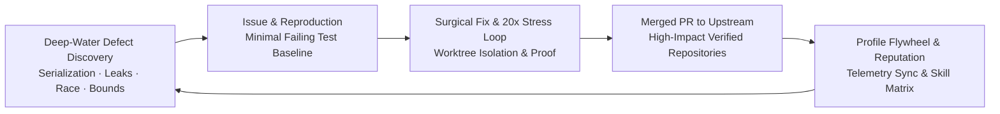

<div align="center">

# 🚀 OpenContrib

**The Agent-Native Open Source Contribution Engine & MCP Server**

[](https://opensource.org/licenses/MIT)
[](https://bun.sh)
[](https://www.typescriptlang.org/)
[](https://modelcontextprotocol.io)
[](#)

<p align="center">
  <b>A composable, protocol-native contribution infrastructure providing autonomous Agents with discrete domain capabilities: Opportunity Signals, Worktree Isolation, Dual-Stage Evidence Verification, Anti-AI Governance, Run Persistence, and Profile Flywheel.</b>
</p>

</div>

---

## 🌟 Philosophy: Contribution Engine, Not Giant Agent

OpenContrib does **not** attempt to replace the external reasoning AI (Claude Code, Cursor, Codex, Devin, Antigravity). Instead, it follows a strict separation of concerns:

```text
                       External AI Agent (Brain)
        ┌───────────────────────────────────────────────────────┐
        │ Claude Code / Cursor / Codex / Devin / Antigravity    │
        └──────────────────────────┬────────────────────────────┘
                                   │
                   Autonomous Reasoning & Decisions
                                   │
                  ┌────────────────┴────────────────┐
                  │                                 │
            GitHub MCP                       OpenContrib MCP
                  │                                 │
       Native GitHub API State              Contribution Engine
  (Issues, PRs, Comments, Repo State)  (Sandbox, Evidence, Governance, Runs)
```

- **External Agent**: Makes high-level decisions, reasons about code, and writes patches.
- **GitHub MCP**: Reads and mutates GitHub repository state.
- **OpenContrib MCP**: Supplies objective feasibility signals, isolated Git Worktree sandboxes, pre-fix to post-fix dual-stage empirical evidence verification, anti-AI governance linter, and structured run persistence.
- *(Internal Core retains a lightweight GitHub adapter strictly for standalone local workflow execution)*.

---

## 📦 Monorepo Architecture

```
opencontrib/
├── packages/
│   ├── core/           # 🧠 Domain logic: Runs, Artifacts, Sandbox, Evidence, Governance, Storage
│   ├── mcp-server/     # 🔌 18 Tools + 3 Resources + 1 Prompt for MCP Clients
│   └── studio/         # 🎨 Obsidian/Claude-themed Native Web Control Studio
├── skills/             # 📜 Master Open-Source Contributor Skill
└── package.json        # 🛠️ Root Monorepo configuration
```

---

## ⚡ Quick Start

```bash
# Clone the repository
git clone https://github.com/MeiSiristhebest/opencontrib.git
cd opencontrib

# Install dependencies via Bun
bun install

# Run full test suite (16 test suites, 78 tests)
bun test
```

---

## 🔌 Model Context Protocol (MCP) Setup

### ⚡ Option 1: One-Click Automatic Setup (Recommended)
Run the auto-installer to automatically detect and configure **Claude Desktop, Cursor, Windsurf, Antigravity, and VS Code / Cline**:

```bash
# Using NPX (Node.js)
npx -y @opencontrib/mcp-server setup

# Or using Bun
bunx @opencontrib/mcp-server setup
```

---

### 🛠️ Option 2: Manual Configuration (Universal `npx` / `bunx`)

No need to clone or hardcode local folder paths! Simply add OpenContrib to your MCP client config (`claude_desktop_config.json`, `~/.cursor/mcp.json`, or `antigravity.json`):

#### Standard Setup (Universal NPX):
```json
{
  "mcpServers": {
    "opencontrib": {
      "command": "npx",
      "args": ["-y", "@opencontrib/mcp-server"]
    }
  }
}
```

#### Dual-MCP Setup (GitHub MCP + OpenContrib MCP):
```json
{
  "mcpServers": {
    "github": {
      "command": "npx",
      "args": ["-y", "@modelcontextprotocol/server-github"],
      "env": {
        "GITHUB_PERSONAL_ACCESS_TOKEN": "your_github_token_here"
      }
    },
    "opencontrib": {
      "command": "npx",
      "args": ["-y", "@opencontrib/mcp-server"]
    }
  }
}
```

### Protocol Capabilities: 18 Tools, 3 Resources, 1 Prompt

| Category | Primitives | Description |
| :--- | :--- | :--- |
| **Run & Session** | `contrib_create_run`<br>`contrib_save_artifact`<br>`contrib_get_run`<br>`contrib_resume_run` | Structured session tracking under `~/.opencontrib/runs/<runId>/` with full crash resume. |
| **Discovery & Feasibility** | `contrib_scout`<br>`contrib_rank_opportunity`<br>`contrib_qualify_issue`<br>`contrib_assess_feasibility`<br>`contrib_diagnose_manifests` | Objective multi-dimensional probability signals (skill, OS feasibility, actionability) without prescribing decisions. |
| **Context & Workspace** | `contrib_assemble_context`<br>`contrib_prepare_workspace`<br>`contrib_purge_sandbox` | Problem skeleton + reading order + target tests + isolated Git worktree sandbox. |
| **Evidence & Governance** | `contrib_collect_evidence`<br>`contrib_audit_governance`<br>`contrib_render_pr_template` | Pre-fix failure assertion + post-fix 20x stress loop; 100-line gate + anti-AI audit. |
| **Flywheel & Lifecycle** | `contrib_sync_flywheel`<br>`contrib_track_pr_status`<br>`contrib_doctor` | Memory ledger, PR lifecycle tracking, and host environment diagnostic. |
| **Resources** | `opencontrib://doctor`<br>`opencontrib://memory`<br>`opencontrib://runs` | Zero-token instant context injection for host health, repo pitfalls, and run history. |
| **Prompts** | `opencontrib_workflow_guide` | Standard 9-step Phase-Gated execution protocol for autonomous Agents. |

---

## 🛡️ Core Verification & Governance Principles

1. **Credential-Isolated Local Execution Environment**: Test and benchmark execution runs with stripped credentials (`~/.ssh`, `~/.aws`, `~/.npmrc`, `GH_TOKEN` purged), redirected `HOME`/`TMPDIR`, and restricted working-directory boundaries.
2. **Dual-Stage Empirical Verification**: Contributions require capturing pre-fix failure baseline assertions and verifying clean 20x stress loop execution post-fix.
3. **100-Line RFC Gate**: Surgical minimal bugfixes; patches exceeding 100 lines require explicit human/RFC approval.
4. **Anti-Bandwagoning & Author Rights**: Enforces 7-day original author priority rights and blocks claiming already assigned issues.
5. **Human-in-the-Loop Gate**: All submissions remain draft-safe until explicit user confirmation.

---

## 💎 High-SNR & Deep-Water Contribution Flywheel

OpenContrib explicitly enforces a **High-Signal-to-Noise Ratio (High-SNR)** standard to eliminate PR farming and maximize long-term maintainer trust:



* **🚫 Anti-Farming Mandate**: Automated deduction (`-35` domain points) and rejection of pure typos, spelling, and trivial list additions that trigger anti-spam penalties in modern reputation engines (such as `ghfind`).
* **🌊 8 Deep-Water Engineering Archetypes**:
  1. **Protocol & Serialization Drift**: Zero-value omission (`omitempty`), HTTP/2 header case normalization, SSE keepalive truncation.
  2. **Lifecycle & Resource Leaks**: Registry Watcher/Listener duplicate registration on reconnect, Context cancellation orphan goroutines, unclosed file descriptors.
  3. **Distributed Cache & Invalidation**: Falsy value cache penetration, out-of-order double write Cache Stampede.
  4. **Memory Layout & Tensor Contiguity**: Non-contiguous strided Tensor C++/CUDA Kernel Segfaults, FFI dangling pointers.
  5. **ReDoS & Backpressure Collapse**: Catastrophic regex backtracking, thundering herd retry storms without full jitter.
  6. **Time Monotonicity & Chrono Hazards**: Wall clock vs. Monotonic clock NTP rollback, DST day boundary jumps.
  7. **Compiler / JIT Escape Invariants**: Hot-path dynamic interface dispatch breaking escape analysis stack allocations.
  8. **Numerical Bounds & Cross-Platform Invariants**: `NaN`/`+Inf` and negative timeout hangs, Windows CRLF / `filepath.ToSlash` path traversal.

### 📊 Scoring Engine Mathematical Model

OpenContrib's opportunity ranking engine (`packages/core/src/discovery/scoring-engine.ts`) calculates candidate priority scores through a mathematically calibrated, multi-tier weighted formula:

$$\text{FinalScore} = \text{clamp}\Big(0, 100, \text{round}\big(0.50 \cdot S_{\text{profile}} + 0.30 \cdot (S_{\text{domain}} + B_{\text{repo}} + B_{\text{deep}} - P_{\text{low\_snr}}) + 0.20 \cdot S_{\text{feasibility}} + M_{\text{freshness}} + M_{\text{actionability}}\big)\Big)$$

#### Component Breakdown & Deep-Water Bonus Calibration:
| Component | Range / Formula | Description |
| :--- | :--- | :--- |
| **$S_{\text{profile}}$ (50% Weight)** | $15 \to 100$ | Developer tech-stack and domain keyword alignment (1 hit = 45, 2 hits = 75, 3+ hits = $75 + (N-2) \times 10$). |
| **$S_{\text{domain}}$ (30% Weight)** | $25 \to 60$ | Issue taxonomy and labels (`bugfix` +10, `help-wanted` +10, `good-first-issue` +15). |
| **$B_{\text{deep}}$ (Deep-Water Bonus)** | **$+15 \to +25$** | **1 matched archetype = $+15$, multiple matched archetypes = $\min(25, 15 + (N - 1) \times 5)$**. Directly elevates deep architectural defects by **$+4.5 \to +7.5$ net points** in final ranking. |
| **$P_{\text{low\_snr}}$ (Anti-Farming Penalty)** | **$-35$** | Applied when pure typo/whitespace is detected without deep-water signals (**$-10.5$ net points penalty**), suppressing low-SNR issues below threshold. |
| **$B_{\text{repo}}$ (Popularity Bonus)** | $0 \to +6$ | Tiered repository popularity signal ($\ge 50$ stars = +3, $\ge 5000$ stars = +6). |
| **$S_{\text{feasibility}}$ (20% Weight)** | $0 \to 100$ | Environment and toolchain execution feasibility ($100 - \text{penalty}$). |
| **$M_{\text{freshness}}$ (Modifier)** | $-20 \to +6$ | Activity recency modifier based on exact max timestamp across creation, update, and comments. |
| **$M_{\text{actionability}}$ (Modifier)** | $-6 \to +6$ | Evaluates presence of stack traces, code blocks, and deterministic reproduction steps. |

---

## 📄 License

Distributed under the [MIT License](LICENSE). Copyright (c) 2026 OpenContrib Contributors.

