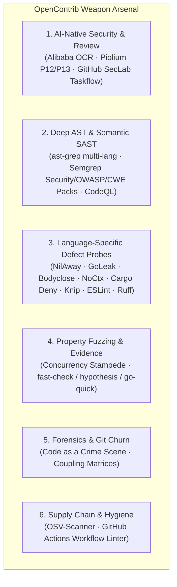

<!-- 
  Designed & Built with ❤️ by MeiSiristhebest (https://github.com/MeiSiristhebest)
  If this repository helps your learning or engineering, please consider dropping a ⭐ Star!
-->
<h1 align="center">🚀 OpenContrib</h1>

<p align="center">
  <b>English | <a href="./README_zh.md">简体中文</a></b>
</p>

> [!TIP]
> 💡 **If this architecture, engineering implementation, or toolchain helps your learning or workflow, please drop a ⭐ Star!**
> 📚 Explore the technical blueprint: [ARCHITECTURE.md](./ARCHITECTURE.md)

<p align="center">
  <b>The Deterministic Open-Source Contribution Engine for Autonomous AI Coding Agents</b>
</p>

<p align="center">
  <a href="https://www.npmjs.com/package/opencontrib-cli"></a>
  <a href="https://opensource.org/licenses/MIT"></a>
</p>

<p align="center">
  <em>A modular contribution infrastructure providing AI agents with discrete engineering primitives: 6-dimension deep defect probes, Smart Pointer progressive dereferencing, clean-room Git worktrees, concurrency stampede evidence verification, and RFC-100 anti-AI governance.</em>
</p>


---

## 📑 Table of Contents

- [💡 Overview](#-overview)
  - [What is OpenContrib?](#what-is-opencontrib)
  - [What OpenContrib is NOT](#what-opencontrib-is-not)
  - [Architecture & Decoupled Layers](#architecture--decoupled-layers)
- [✨ Key Capabilities](#-key-capabilities)
  - [1. The 6-Dimension Weapon Arsenal](#1-the-6-dimension-weapon-arsenal)
  - [2. Top-K Smart Pointer Triage & 1-Click Resolution](#2-top-k-smart-pointer-triage--1-click-resolution)
  - [3. Concurrency Stampede & Chaos Jitter Evidence](#3-concurrency-stampede--chaos-jitter-evidence)
  - [4. In-Domain Sister-Module Variant Hunting](#4-in-domain-sister-module-variant-hunting)
- [⚙️ Requirements](#️-requirements)
- [📦 Installation](#-installation)
- [🚀 Quick Start (5-Minute End-to-End Walkthrough)](#-quick-start-5-minute-end-to-end-walkthrough)
- [🗺️ Command Reference](#️-command-reference)
- [🔌 MCP Protocol Integration](#-mcp-protocol-integration)
- [🛡️ The 5 Absolute Engineering Invariants](#️-the-5-absolute-engineering-invariants)
- [🤝 Contributing](#-contributing)
- [📜 License](#-license)

---

## 💡 Overview

### What is OpenContrib?

OpenContrib is a **domain engine for open-source software contributions**. It equips reasoning agents (such as Google Antigravity, Claude Code, Cursor, Codex, or Devin) with deterministic primitives required to discover real defects, empirically verify reproduction in isolated sandboxes, enforce architectural limits, and submit maintainer-grade pull requests.

### What OpenContrib is NOT

- **NOT a Monolithic Coding Bot**: It does not replace the LLM brain; it gives external agents a structured toolchain.
- **NOT an AI PR Spammer**: It strictly enforces an anti-bandwagoning claim protocol, a 100-line RFC diff gate, and zero-tolerance anti-robotic filters to protect maintainer trust.

### Architecture & Decoupled Layers

```text
    ┌──────────────────────────────────────────────────────────────────┐
    │              External AI Agent (Reasoning Brain)                 │
    │    Google Antigravity · Claude Code · Cursor · Codex · Devin     │
    │                                                                  │
    │  Autonomous Reasoning · Decision Making · Code Writing            │
    └───────────────────────────┬──────────────────────────────────────┘
                                │ Shell / CLI invocations
                                ▼
    ┌──────────────────────────────────────────────────────────────────┐
    │                  OpenContrib CLI (Tool Layer)                     │
    │                                                                  │
    │  probe · pointer · capability · evidence · workspace · plugin    │
    │  governance · discovery · run · flywheel · doctor                │
    └───────────────────────────┬──────────────────────────────────────┘
                                │ Pure TypeScript imports
                                ▼
    ┌──────────────────────────────────────────────────────────────────┐
    │                @opencontrib/core (Domain Microkernel)            │
    │                                                                  │
    │  13 modules · 0 MCP dependencies · 0 CLI framework dependencies  │
    │  Probe · Sandbox · Evidence · Governance · Flywheel · Run        │
    │  Storage · GitHub · Risk · Orchestration · LLM · Memory · Kernel │
    └──────────────────────────────────────────────────────────────────┘
```

> **Design Principle**: `packages/core/` maintains zero dependencies on interface layers. The CLI (`opencontrib-cli`) is the primary interface, while the MCP server (`opencontrib-mcp`) acts as an adapter for MCP-native agents.

---

## ✨ Key Capabilities

### 1. The 6-Dimension Weapon Arsenal

OpenContrib provides 6 specialized probe dimensions out-of-the-box:



### 2. Top-K Smart Pointer Triage & 1-Click Resolution

Instead of flooding agent contexts with thousands of raw SAST lines, `opencontrib probe run` automatically scores findings by `Severity x CategoryMultiplier x Confidence` and triages down to **Top 5 high-value actionable defect pointers** (`ptr://...`). Each candidate provides an instant slice dereference command:

```bash
# Level 2: Fetch 150-token code slice directly (zero context bloat)
opencontrib pointer resolve ptr://findings/ast-ts-unhandled-promise-catch-foo-108 --view slice
```

### 3. Active Session Engine & Automatic Context Propagation

When a contribution run starts via `opencontrib run create`, OpenContrib creates and synchronizes an **Active Session** (`~/.opencontrib/active_session.json`). Subsequent commands (`workspace prepare`, `evidence`, `governance audit`, `governance pr-template`, `flywheel sync`) automatically inherit the `runId`, workspace directory, and tracking stream without requiring repetitive command-line flags.

### 4. Hard-Gated Governance & Non-Zero Exit Code 2 Barrier

`opencontrib governance audit` enforces strict industrial quality thresholds ($\ge 90\%$ composite score, $\ge 80\%$ on all sub-dimensions, zero anti-AI conversational prose, and $\le 100$-line diffs). If any criteria fail, the CLI outputs a detailed `🛑 GATED_BLOCKED` terminal block and terminates with **Exit Code 2**, physically preventing AI agents from opening unverified or non-compliant PRs.

### 5. Self-Guiding State Machine Terminal Output

Every CLI command terminates with an explicit guidance block displaying:
- `📍 PHASE`: The current lifecycle milestone.
- `▶ NEXT RECOMMENDED COMMAND`: The deterministic next shell command to execute.
- `🛑 FORBIDDEN IN THIS PHASE`: Guardrails against premature actions.
- `🎯 HUMAN CHECKPOINT`: Required review points before public GitHub interactions.

### 6. Concurrency Stampede & Chaos Jitter Evidence

Replaces superficial test loops with real multi-worker contention:
- **`concurrencyWorkers`**: Concurrent threads executing under shared state competition.
- **`raceCollisionsDetected`**: Catches mutex collisions, duplicate key bypasses, and data races.
- **`latencyJitterMs`**: Quantifies execution time variance across concurrent workers.
- **`zeroAssertionWarning`**: Rejects no-op tests containing 0 real assertions.

### 7. In-Domain Sister-Module Variant Hunting

When a defect is remediated in one module (e.g. `mongodb-adapter.ts`), the governance auditor evaluates whether sister components (`sqlite-adapter.ts`, `pg-adapter.ts`) were swept for identical anti-patterns.

---

## ⚙️ Requirements

| Toolchain | Minimum Version | Note |
| :--- | :--- | :--- |
| **Bun** | `v1.2.0+` | Primary test & build runner |
| **Node.js** | `v22.0.0+` | Runtime environment for CLI/MCP packages |
| **Git** | `v2.38.0+` | Required for `git worktree` isolation |

---

## 📦 Installation

```bash
# Global install via npm
npm install -g opencontrib-cli

# Verify environment & installed toolchains
opencontrib doctor --pretty
```

Or run directly with `npx`:

```bash
npx -y opencontrib-cli doctor
```

---

## 🚀 Quick Start (5-Minute End-to-End Walkthrough)

### Step 1: Scan & Triage High-Value Defects (Proactive Track A)

```bash
opencontrib probe run ./target-repo --pretty
```

### Step 2: Dereference Top Smart Pointer Code Slice

```bash
opencontrib pointer resolve ptr://findings/<pointer_id> --view slice
```

### Step 3: Prepare Clean-Room Worktree Sandbox

```bash
opencontrib workspace prepare --repo owner/repo --issue 0 --run-id "$RUN_ID"
# Captures isolated workspacePath
```

### Step 4: Construct Red Reproduction Test & Apply Surgical Fix

Write targeted reproduction test, verify failure (RED), apply minimal idiomatic fix ($\le 100$ lines), and verify pass (GREEN).

### Step 5: Collect Empirical Verification Evidence

```bash
opencontrib evidence \
  --cwd "$WORKSPACE_PATH" \
  --test-cmd "bun test src/specific.test.ts" \
  --run-id "$RUN_ID"
```

### Step 6: Governance Audit & PR Submission

```bash
# Verify RFC-100 limit, anti-AI linting, and 7D quality score >= 90
git -C "$WORKSPACE_PATH" diff > diff.patch
opencontrib governance audit \
  --patch diff.patch \
  --pr-title "fix: resolve unhandled nil pointer in parser" \
  --pr-body-file pr-body.md \
  --subagent-score 95 \
  --pretty

# Register Issue first with Claim statement
gh issue create --repo owner/repo --title "[Bug]: Unhandled nil pointer in parser" --body-file issue_body.md

# Render maintainer PR template and submit PR
opencontrib governance pr-template \
  --issue 42 \
  --issue-title "Unhandled nil pointer in parser" \
  --summary "Add defensive boundary check to prevent parser panic" \
  | jq -r '.prBody' > pr-body.md
gh pr create --repo owner/repo --title "fix: resolve unhandled nil pointer in parser" --body-file pr-body.md --draft
```

---

## 🗺️ Command Reference

Industrial-grade command set spanning 16 core capability domains:

| Domain | Command | Description |
| :--- | :--- | :--- |
| **Probe** | `probe run [target]` | Execute multi-probe SAST with Top-K triage |
| | `probe plan [target]` | Extract repository fingerprint and probe negotiation plan |
| | `probe hotspot [target]` | Run Code as a Crime Scene Git churn analysis |
| | `probe fuzz [target]` | Generate property-based boundary fuzzing test harness |
| **Pointer** | `pointer resolve <uri>` | 3-level progressive dereferencing (`--view stub&#124;slice&#124;evidence`) |
| | `pointer list [namespace]` | List registered pointers in current session store |
| **Capability**| `capability list` | List registered microkernel capability adapters & domains |
| | `capability plan [target]` | Run capability scoring engine to derive optimal execution plan |
| **Evidence** | `evidence` | Concurrency stampede chaos verification and dual-stage reproduction |
| **Workspace** | `workspace prepare` | Create clean-room Git worktree sandbox |
| | `workspace purge` | Safely destroy ephemeral sandbox directories & bare repo cache |
| | `workspace list` | List all active and cached workspace sandboxes |
| **Governance**| `governance audit` | 7-Dimensional quality rubric, RFC-100 diff, and anti-AI check |
| | `governance impact` | 360° cross-platform filepath/CRLF/sister-module hazard detector |
| | `governance ci-diagnose` | GitHub Actions CI raw log root cause diagnostics |
| | `governance pr-template`| Merge contribution metadata into repository native PR template |
| | `governance claim` | Generate authoritative Issue-First Claim statement or 0-day proposal |
| | `governance lint-md` | Run static markdown encoding integrity and lint checks |
| **Discovery** | `scout <repo>` | Multi-signal issue opportunity scouting (top-level command) |
| | `discovery rank` | Multi-dimensional opportunity probability ranking |
| | `discovery qualify` | Anti-bandwagoning claim qualification filter |
| | `discovery feasibility`| Environment and toolchain feasibility assessment |
| | `discovery context` | Assemble deterministic cross-file context bundles |
| | `discovery manifests` | Diagnose repository package manifests and workflows |
| **Plugin** | `plugin list` / `status` | List registered SAST and AST scanner plugins and active status |
| | `plugin enable` / `disable` | Dynamically enable or disable specific probes/tools |
| | `plugin install <id>` | Install toolchain and host binary dependencies |
| | `plugin reset` / `info` | Reset plugin states to default or inspect specific probe metadata |
| **Run** | `run create` / `get` / `list`| Create, retrieve, and list auditable runs under `~/.opencontrib/runs/` |
| | `run resume <id>` | Resume interrupted contribution pipeline session |
| | `run save <id>` | Persist stage artifact to auditable run session |
| **Flywheel** | `flywheel sync` | Sync repository profile and contribution memory ledger |
| | `flywheel pr-track` | Track PR merge readiness, CI checks, and review feedback |
| **Eval** | `eval judge` / `parse-judgment` | G-Eval trajectory compression and agent blind judgment parser |
| | `eval reflexion` / `benchmark` | Extract reflexion insights to memory and run benchmark suites |
| **System** | `doctor` | Diagnose local toolchain, probe binaries, and environment health |
| | `setup` | Auto-configure MCP servers across Claude Code, Cursor, Windsurf |
| | `config` / `verify` | Inspect workspace config, execute dual-stage verification |

---

## 🔌 Seamless Agent Integration

OpenContrib works out-of-the-box as an autonomous toolchain and MCP engine across all leading AI coding assistants:

### 1. Claude Code
OpenContrib provides native `CLAUDE.md` instructions and MCP integration for Claude Code:
```bash
# Add OpenContrib MCP server to Claude Code
claude mcp add opencontrib npx -y opencontrib-cli mcp
```

### 2. Cursor (Composer & Agent)
OpenContrib includes pre-configured `.cursor/rules/opencontrib.mdc` and `.cursorrules`:
```json
// Add to ~/.cursor/mcp.json or .cursor/mcp.json:
{
  "mcpServers": {
    "opencontrib": {
      "command": "npx",
      "args": ["-y", "opencontrib-cli", "mcp"]
    }
  }
}
```

### 3. OpenAI Codex / Custom Assistants
OpenContrib includes standard `AGENTS.md` and `CODEX.md` directives to orchestrate the 9-phase contribution pipeline deterministically.

### 4. 1-Click Multi-Agent Setup
```bash
# Auto-configure MCP servers across all detected IDEs & agents
npx -y opencontrib-cli setup
```

Or add to client configuration:

```json
{
  "mcpServers": {
    "opencontrib": {
      "command": "npx",
      "args": ["-y", "opencontrib-mcp"]
    }
  }
}
```

**MCP Capabilities**: 34 Composable Tools across 9 domains (`contrib_scout`, `contrib_prepare_workspace`, `contrib_collect_evidence`, `contrib_audit_governance`, etc.), 3 Resources (`opencontrib://doctor`, `opencontrib://memory`, `opencontrib://runs`), and 1 Prompt (`opencontrib_workflow_guide`).

---

## 🛡️ The 6 Absolute Engineering Invariants

1. **CLI-First Execution Priority (Dual-Ingress Ready)**:
   Prioritize executing commands directly via terminal (`opencontrib <command>`) to leverage active session auto-inheritance and self-guiding state machine prompts. The 34 composable tools of `opencontrib-mcp` remain first-class supported for MCP-native agents.
2. **Anti-Drift Circuit Breaker (Max 3 `view_file` calls)**:
   Avoid blind sequential file reads (> 3 views). Pinpoint symbols strictly via Smart Pointer slices (`ptr://...`) or `grep_search`.
3. **Mandatory Issue-First on 0-Days (No Blind PRs)**:
   For proactive 0-day discoveries, **ALWAYS create a GitHub Issue first** (`gh issue create --body-file ...`) with an authoritative Claim statement. PR descriptions **MUST anchor `Fixes #<id>`**.
4. **Targeted Subsystem Test Isolation (No Global Flaky Runs)**:
   Never run broad root tests (`go test ./...` or `npm test` at repo root). Always scope test commands strictly to modified sub-packages.
5. **Anti-Deadlock Search Mandate**:
   Every `rg` or `fd` command **MUST explicitly specify a target directory** (e.g. `rg "pattern" .`). Never omit target paths to prevent 30-minute stdin hangs.
6. **Local Markdown Files for GitHub CLI**:
   Always write Issue and PR bodies to temporary `.md` files and pass `--body-file <file>` to avoid shell escaping errors.

---

## 🤝 Contributing

Contributions are welcome! Please read [`CONTRIBUTING.md`](./CONTRIBUTING.md) and [`DEVELOPMENT_SOP.md`](./DEVELOPMENT_SOP.md) before submitting pull requests.

```bash
# Run full test matrix
bun test

# Run TypeScript type check
bun x tsc --noEmit
```

---

## 📜 License

Distributed under the [MIT License](LICENSE). Copyright (c) 2026 OpenContrib Contributors.

---

## ⭐ Star & Support

If you find this project useful or inspiring, please consider giving it a ⭐ **Star** on GitHub! It helps more developers discover the work and supports continuous open-source maintenance.

<p align="center">
  <a href="https://www.star-history.com/?repos=MeiSiristhebest%2Fopencontrib&type=date&legend=bottom-right">
    <picture>
      <source media="(prefers-color-scheme: dark)" srcset="https://api.star-history.com/chart?repos=MeiSiristhebest/opencontrib&type=date&theme=dark&legend=bottom-right&sealed_token=uaVldQgHazK-DcCE89936BEzAUE1ErdhsQqB7B583EJxvNyhoxZkU2soE6gCjSGsdn5TpVFHAzFZx8D-0S5bVhb8lmr1rrsJOU_UV3x9DqHUQ-cQJYtXBw" />
      <source media="(prefers-color-scheme: light)" srcset="https://api.star-history.com/chart?repos=MeiSiristhebest/opencontrib&type=date&legend=bottom-right&sealed_token=uaVldQgHazK-DcCE89936BEzAUE1ErdhsQqB7B583EJxvNyhoxZkU2soE6gCjSGsdn5TpVFHAzFZx8D-0S5bVhb8lmr1rrsJOU_UV3x9DqHUQ-cQJYtXBw" />
      
    </picture>
  </a>
</p>

### 🤝 Contributors
<a href="https://github.com/MeiSiristhebest/opencontrib/graphs/contributors">
  
</a>

<!-- Scarf Telemetry Pixel -->

