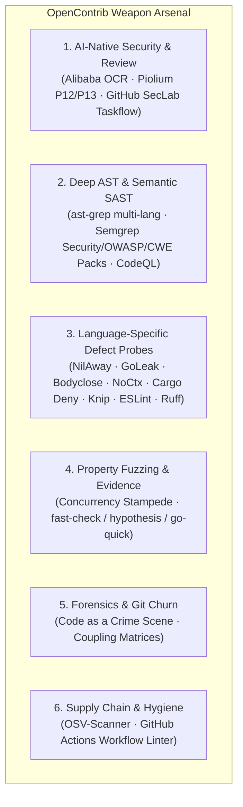

<div align="center">

# 🚀 OpenContrib

**The Deterministic Open-Source Contribution Engine for Autonomous AI Coding Agents**

[](https://opensource.org/licenses/MIT)
[](https://bun.sh)
[](https://www.typescriptlang.org/)
[](https://github.com/MeiSiristhebest/opencontrib)
[](https://github.com/MeiSiristhebest/opencontrib)
[](https://github.com/MeiSiristhebest/opencontrib#mcp-protocol-integration)
[](https://github.com/MeiSiristhebest/opencontrib#command-reference)
[](https://www.npmjs.com/package/opencontrib-cli)
[](https://github.com/MeiSiristhebest/opencontrib/blob/main/CONTRIBUTING.md)

<p align="center">
  <b>[ English | <a href="./README_zh.md">简体中文</a> ]</b>
</p>

<p align="center">
  <b>A modular contribution infrastructure providing AI agents with discrete engineering primitives: 6-dimension deep defect probes, Smart Pointer progressive dereferencing, clean-room Git worktrees, concurrency stampede evidence verification, and RFC-100 anti-AI governance.</b>
</p>

</div>

---

## 📑 Table of Contents

- [💡 Overview](#-overview)
  - [What is OpenContrib?](#what-is-opencontrib)
  - [What OpenContrib is NOT](#what-opencontrib-is-not)
  - [Architecture & Decoupled Layers](#architecture--decoupled-layers)
- [✨ Key Capabilities](#-key-capabilities)
  - [1. The 6-Dimension Weapon Arsenal](#1-the-6-dimension-weapon-arsenal)
  - [2. Top-K Smart Pointer Triage & 1-Click Resolution](#2-top-k-smart-pointer-triage--1-click-resolution)
  - [3. Concurrency Stampede & Chaos Jitter Evidence](#3-concurrency-stampede--chaos-jitter-evidence)
  - [4. In-Domain Sister-Module Variant Hunting](#4-in-domain-sister-module-variant-hunting)
- [⚙️ Requirements](#️-requirements)
- [📦 Installation](#-installation)
- [🚀 Quick Start (5-Minute End-to-End Walkthrough)](#-quick-start-5-minute-end-to-end-walkthrough)
- [🗺️ Command Reference](#️-command-reference)
- [🔌 MCP Protocol Integration](#-mcp-protocol-integration)
- [🛡️ The 5 Absolute Engineering Invariants](#️-the-5-absolute-engineering-invariants)
- [🤝 Contributing](#-contributing)
- [📜 License](#-license)

---

## 💡 Overview

### What is OpenContrib?

OpenContrib is a **domain engine for open-source software contributions**. It equips reasoning agents (such as Google Antigravity, Claude Code, Cursor, Codex, or Devin) with deterministic primitives required to discover real defects, empirically verify reproduction in isolated sandboxes, enforce architectural limits, and submit maintainer-grade pull requests.

### What OpenContrib is NOT

- **NOT a Monolithic Coding Bot**: It does not replace the LLM brain; it gives external agents a structured toolchain.
- **NOT an AI PR Spammer**: It strictly enforces an anti-bandwagoning claim protocol, a 100-line RFC diff gate, and zero-tolerance anti-robotic filters to protect maintainer trust.

### Architecture & Decoupled Layers

```text
    ┌──────────────────────────────────────────────────────────────────┐
    │              External AI Agent (Reasoning Brain)                 │
    │    Google Antigravity · Claude Code · Cursor · Codex · Devin     │
    │                                                                  │
    │  Autonomous Reasoning · Decision Making · Code Writing            │
    └───────────────────────────┬──────────────────────────────────────┘
                                │ Shell / CLI invocations
                                ▼
    ┌──────────────────────────────────────────────────────────────────┐
    │                  OpenContrib CLI (Tool Layer)                     │
    │                                                                  │
    │  probe · pointer · capability · evidence · workspace · plugin    │
    │  governance · discovery · run · flywheel · doctor                │
    └───────────────────────────┬──────────────────────────────────────┘
                                │ Pure TypeScript imports
                                ▼
    ┌──────────────────────────────────────────────────────────────────┐
    │                @opencontrib/core (Domain Microkernel)            │
    │                                                                  │
    │  13 modules · 0 MCP dependencies · 0 CLI framework dependencies  │
    │  Probe · Sandbox · Evidence · Governance · Flywheel · Run        │
    │  Storage · GitHub · Risk · Orchestration · LLM · Memory · Kernel │
    └──────────────────────────────────────────────────────────────────┘
```

> **Design Principle**: `packages/core/` maintains zero dependencies on interface layers. The CLI (`opencontrib-cli`) is the primary interface, while the MCP server (`opencontrib-mcp`) acts as an adapter for MCP-native agents.

---

## ✨ Key Capabilities

### 1. The 6-Dimension Weapon Arsenal

OpenContrib provides 6 specialized probe dimensions out-of-the-box:



### 2. Top-K Smart Pointer Triage & 1-Click Resolution

Instead of flooding agent contexts with thousands of raw SAST lines, `opencontrib probe run` automatically scores findings by `Severity x CategoryMultiplier x Confidence` and triages down to **Top 5 high-value actionable defect pointers** (`ptr://...`). Each candidate provides an instant slice dereference command:

```bash
# Level 2: Fetch 150-token code slice directly (zero context bloat)
opencontrib pointer resolve ptr://findings/ast-ts-unhandled-promise-catch-foo-108 --view slice
```

### 3. Concurrency Stampede & Chaos Jitter Evidence

Replaces superficial test loops with real multi-worker contention:
- **`concurrencyWorkers`**: Concurrent threads executing under shared state competition.
- **`raceCollisionsDetected`**: Catches mutex collisions, duplicate key bypasses, and data races.
- **`latencyJitterMs`**: Quantifies execution time variance across concurrent workers.
- **`zeroAssertionWarning`**: Rejects no-op tests containing 0 real assertions.

### 4. In-Domain Sister-Module Variant Hunting

When a defect is remediated in one module (e.g. `mongodb-adapter.ts`), the governance auditor evaluates whether sister components (`sqlite-adapter.ts`, `pg-adapter.ts`) were swept for identical anti-patterns.

---

## ⚙️ Requirements

| Toolchain | Minimum Version | Note |
| :--- | :--- | :--- |
| **Bun** | `v1.2.0+` | Primary test & build runner |
| **Node.js** | `v22.0.0+` | Runtime environment for CLI/MCP packages |
| **Git** | `v2.38.0+` | Required for `git worktree` isolation |

---

## 📦 Installation

```bash
# Global install via npm
npm install -g opencontrib-cli

# Verify environment & installed toolchains
opencontrib doctor --pretty
```

Or run directly with `npx`:

```bash
npx -y opencontrib-cli doctor
```

---

## 🚀 Quick Start (5-Minute End-to-End Walkthrough)

### Step 1: Scan & Triage High-Value Defects (Proactive Track A)

```bash
opencontrib probe run ./target-repo --pretty
```

### Step 2: Dereference Top Smart Pointer Code Slice

```bash
opencontrib pointer resolve ptr://findings/<pointer_id> --view slice
```

### Step 3: Prepare Clean-Room Worktree Sandbox

```bash
opencontrib workspace prepare --repo owner/repo --issue 0 --run-id "$RUN_ID"
# Captures isolated workspacePath
```

### Step 4: Construct Red Reproduction Test & Apply Surgical Fix

Write targeted reproduction test, verify failure (RED), apply minimal idiomatic fix ($\le 100$ lines), and verify pass (GREEN).

### Step 5: Collect Empirical Verification Evidence

```bash
opencontrib evidence \
  --cwd "$WORKSPACE_PATH" \
  --test-cmd "bun test src/specific.test.ts" \
  --run-id "$RUN_ID"
```

### Step 6: Governance Audit & PR Submission

```bash
# Verify RFC-100 limit, anti-AI linting, and 7D quality score >= 90
git -C "$WORKSPACE_PATH" diff | opencontrib governance audit --line-count 40 --subagent-score 95

# Register Issue first with Claim statement
gh issue create --repo owner/repo --body-file issue_body.md

# Render maintainer PR template and submit PR
opencontrib governance pr-template --issue 42 --summary "..." | jq -r '.prBody' > pr-body.md
gh pr create --repo owner/repo --title "fix: ..." --body-file pr-body.md --draft
```

---

## 🗺️ Command Reference

24 subcommands across 10 core capability domains:

| Domain | Command | Description |
| :--- | :--- | :--- |
| **Probe** | `probe run [target]` | Execute multi-probe SAST with Top-K triage |
| | `probe plan [target]` | Extract repository fingerprint and probe negotiation plan |
| | `probe hotspot [target]` | Run Code as a Crime Scene Git churn analysis |
| | `probe fuzz [target]` | Generate property-based boundary fuzzing test harness |
| **Pointer** | `pointer resolve <uri>` | 3-level progressive dereferencing (`--view summary\|slice\|evidence`) |
| | `pointer list` | List registered pointers in current session store |
| **Capability**| `capability list` | List registered microkernel capability adapters |
| | `capability route` | Route capabilities dynamically based on repo fingerprint |
| | `capability score` | Derive multi-signal weighted capability score |
| **Evidence** | `evidence` | Concurrency stampede chaos verification and dual-stage reproduction |
| **Workspace** | `workspace prepare` | Create clean-room Git worktree sandbox |
| | `workspace purge` | Safely destroy ephemeral sandbox directories |
| **Governance**| `governance audit` | 7-Dimensional quality rubric, RFC-100 diff, and anti-AI check |
| | `governance impact` | 360° cross-platform filepath/CRLF/sister-module hazard detector |
| | `governance ci-diagnose` | GitHub Actions CI raw log root cause diagnostics |
| | `governance pr-template`| Merge contribution metadata into repository native PR template |
| **Discovery** | `scout <repo>` | Multi-signal issue opportunity scouting |
| | `discovery rank` | Multi-dimensional opportunity ranking |
| | `discovery qualify` | Anti-bandwagoning claim qualification filter |
| | `discovery feasibility`| Environment and toolchain feasibility assessment |
| | `discovery context` | Assemble deterministic cross-file context bundles |
| | `discovery manifests` | Diagnose repository package manifests |
| **Plugin** | `plugin list` | List registered SAST and AST scanner plugins |
| **Run** | `run create` | Initialize auditable session under `~/.opencontrib/runs/` |
| | `run resume` | Resume interrupted contribution pipeline session |
| **Flywheel** | `flywheel sync` | Sync repository profile and contribution memory ledger |
| | `doctor` | Diagnose local toolchain, probe binaries, and environment health |

---

## 🔌 MCP Protocol Integration

For MCP-native agent environments (Claude Desktop, Cursor, Antigravity):

```bash
# Auto-configure client
npx -y opencontrib-mcp setup
```

Or add to client configuration:

```json
{
  "mcpServers": {
    "opencontrib": {
      "command": "npx",
      "args": ["-y", "opencontrib-mcp"]
    }
  }
}
```

**MCP Capabilities**: 34 Composable Tools across 9 domains (`contrib_scout`, `contrib_prepare_workspace`, `contrib_collect_evidence`, `contrib_audit_governance`, etc.), 3 Resources (`opencontrib://doctor`, `opencontrib://memory`, `opencontrib://runs`), and 1 Prompt (`opencontrib_workflow_guide`).

---

## 🛡️ The 5 Absolute Engineering Invariants

1. **Anti-Drift Circuit Breaker (Max 3 `view_file` calls)**:
   Avoid blind sequential file reads (> 3 views). Pinpoint symbols strictly via Smart Pointer slices (`ptr://...`) or `grep_search`.
2. **Mandatory Issue-First on 0-Days (No Blind PRs)**:
   For proactive 0-day discoveries, **ALWAYS create a GitHub Issue first** (`gh issue create --body-file ...`) with an authoritative Claim statement. PR descriptions **MUST anchor `Fixes #<id>`**.
3. **Targeted Subsystem Test Isolation (No Global Flaky Runs)**:
   Never run broad root tests (`go test ./...` or `npm test` at repo root). Always scope test commands strictly to modified sub-packages.
4. **Anti-Deadlock Search Mandate**:
   Every `rg` or `fd` command **MUST explicitly specify a target directory** (e.g. `rg "pattern" .`). Never omit target paths to prevent 30-minute stdin hangs.
5. **Local Markdown Files for GitHub CLI**:
   Always write Issue and PR bodies to temporary `.md` files and pass `--body-file <file>` to avoid shell escaping errors.

---

## 🤝 Contributing

Contributions are welcome! Please read [`CONTRIBUTING.md`](./CONTRIBUTING.md) and [`DEVELOPMENT_SOP.md`](./DEVELOPMENT_SOP.md) before submitting pull requests.

```bash
# Run full test matrix
bun test

# Run TypeScript type check
bun x tsc --noEmit
```

---

## ⭐ Star & Support

If OpenContrib assists your AI agent workflows or open-source research, please consider giving this repository a ⭐ **Star**! It helps the project gain visibility and motivates ongoing development.

[](https://star-history.com/#MeiSiristhebest/opencontrib&Date)

---

## 📜 License

Distributed under the [MIT License](LICENSE). Copyright (c) 2026 OpenContrib Contributors.

