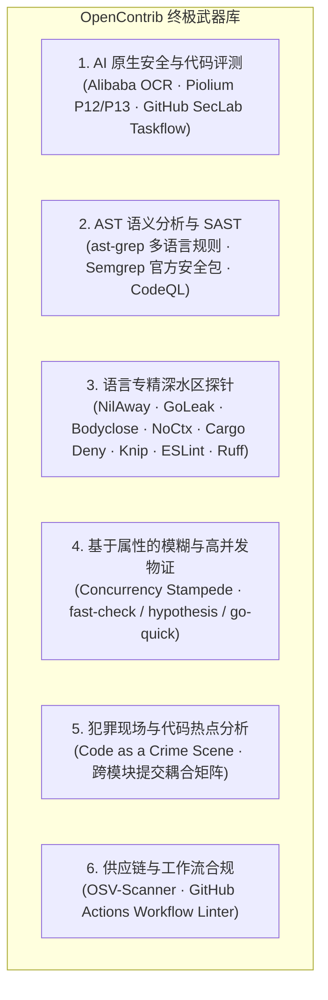

<!-- 
  Designed & Built with ❤️ by MeiSiristhebest (https://github.com/MeiSiristhebest)
  If this repository helps your learning or engineering, please consider dropping a ⭐ Star!
-->
<h1 align="center">🚀 OpenContrib</h1>

<p align="center">
  <b><a href="./README.md">English</a> | 简体中文</b>
</p>

> [!TIP]
> 💡 **如果本项目的架构设计、工程实践或开源基础设施对您有所启发，欢迎点亮右上角 ⭐ Star 支持创作者！**
> 📚 查阅核心架构设计文档：[ARCHITECTURE_zh.md](./ARCHITECTURE_zh.md)

<p align="center">
  <b>面向自主编程 AI Agent 的确定性开源贡献工业级引擎</b>
</p>

<p align="center">
  <a href="https://www.npmjs.com/package/@opencontrib/cli"></a>
  <a href="https://opensource.org/licenses/MIT"></a>
</p>

<p align="center">
  <em>为自主编程 AI Agent（如 Google Antigravity、Claude Code、Cursor、Devin 等）量身打造的开源贡献基础设施：提供 6 维深水区武器库探针、Smart Pointer 渐进式切片解引用、Worktree 沙盒隔离、并发抢占风暴物证校验、反 AI 噪音治理门禁、持久化会话状态与贡献飞轮。</em>
</p>

---

## 📑 目录

- [💡 项目定位与概览](#-项目定位与概览)
  - [什么是 OpenContrib？](#什么是-opencontrib)
  - [OpenContrib 不是什么？](#opencontrib-不是什么)
  - [分层解耦架构](#分层解耦架构)
- [✨ 核心武器与关键特性](#-核心武器与关键特性)
  - [1. 6 维深水区武器库矩阵](#1-6-维深水区武器库矩阵)
  - [2. Top-K 智能指针收敛与 1-Click 切片读取](#2-top-k-智能指针收敛与-1-click-切片读取)
  - [3. 并发抢占风暴与混沌抖动物证](#3-并发抢占风暴与混沌抖动物证)
  - [4. 领域内姊妹模块变种猎杀](#4-领域内姊妹模块变种猎杀)
- [⚙️ 环境依赖](#️-环境依赖)
- [📦 安装指南](#-安装指南)
- [🚀 5 分钟端到端快速上手](#-5-分钟端到端快速上手)
- [🗺️ 子命令全景速查表](#️-子命令全景速查表)
- [🔌 MCP 协议集成配置](#-mcp-协议集成配置)
- [🛡️ 5 大绝对工程防线（零容忍红线）](#️-5-大绝对工程防线零容忍红线)
- [🤝 参与贡献](#-参与贡献)
- [📜 开源协议](#-开源协议)

---

## 💡 项目定位与概览

### 什么是 OpenContrib？

OpenContrib 是一套**开源贡献领域专用引擎**。它不试图替代大模型本身的通用推理能力，而是为外部推理 Agent（如 Google Antigravity、Claude Code、Cursor、Codex 或 Devin）提供一套**确定性、可复用、深水区的工程武器库与贡献原语**，帮助 Agent 挖掘真实缺陷、在沙盒中双阶段经验性复现、通过 RFC 质量门禁并交付高赞合入 PR。

### OpenContrib 不是什么？

- **不是单体黑盒聊天 Agent**：它不捆绑特定 LLM，而是通过纯命令行与 MCP 向外部大脑提供标准化工程工具。
- **不是 AI 垃圾 PR 刷分器**：内置防跟风抢占排他性认领协议、100 行 RFC 补丁限制与反 AI 机械式行话检测，坚决捍卫开源维护者信任。

### 分层解耦架构

```text
    ┌──────────────────────────────────────────────────────────────────┐
    │              外部 AI Agent（决策与推理大脑）                     │
    │    Google Antigravity · Claude Code · Cursor · Codex · Devin     │
    │                                                                  │
    │  自主逻辑推理 · 架构决策 · 代码编写 · 人机对齐                    │
    └───────────────────────────┬──────────────────────────────────────┘
                                │ Shell / CLI 调用
                                ▼
    ┌──────────────────────────────────────────────────────────────────┐
    │                 OpenContrib CLI（轻量级工具层）                   │
    │                                                                  │
    │  probe · pointer · capability · evidence · workspace · plugin    │
    │  governance · discovery · run · flywheel · doctor                │
    └───────────────────────────┬──────────────────────────────────────┘
                                │ 纯 TypeScript 类型引入
                                ▼
    ┌──────────────────────────────────────────────────────────────────┐
    │                @opencontrib/core（领域微内核）                   │
    │                                                                  │
    │  13 个纯领域模块 · 0 MCP 强依赖 · 0 CLI 框架强依赖               │
    │  Probe · Sandbox · Evidence · Governance · Flywheel · Run        │
    │  Storage · GitHub · Risk · Orchestration · LLM · Memory · Kernel │
    └──────────────────────────────────────────────────────────────────┘
```

> **设计原则**：`packages/core/` 对上层接口完全解耦。CLI（`@opencontrib/cli`）作为无摩擦的第一类公民接口；同时提供标准 MCP 服务（`@opencontrib/mcp`）以无缝接入 MCP 原生 Agent。

---

## ✨ 核心武器与关键特性

### 1. 6 维深水区武器库矩阵

OpenContrib 开箱集成了 6 大维度的专业分析武器：



### 2. Top-K 智能指针收敛与 1-Click 切片读取

执行 `opencontrib probe run` 时，系统自动按照 `危害等级 x 类别权重 x 置信度` 进行加权打分，**默认仅输出 Top 5 核心高价值缺陷候选**，并在每条下方附带一键解引用命令：

```bash
# Level 2: 秒级读取 150-token 黄金代码切片（彻底避免上下文淹没）
opencontrib pointer resolve ptr://findings/ast-ts-unhandled-promise-catch-foo-108 --view slice
```

### 3. 活跃会话引擎与上下文自动继承 (Active Session Engine)

通过 `opencontrib run create` 初始化会话后，系统自动在 `~/.opencontrib/active_session.json` 维持当前活跃会话。后续所有子命令（`workspace prepare`、`evidence`、`governance audit`、`governance pr-template`、`flywheel sync`）均**免传 `--run-id` 与 `--cwd`**，自动绑定上下文并将事件流与物证实时写盘。

### 4. 刚性质量门禁与非零返回码硬阻断 (Hard Gating Exit Code 2)

`opencontrib governance audit` 严格执行工业级门禁标准（综合评分 $\ge 90\%$、所有单项 $\ge 80\%$、RFC-100 行内修改、零 AI 模板痕迹）。若未达到标准，CLI 打印醒目的 `🛑 GATED_BLOCKED` 警告并以 **Exit Code 2 强制终止**，物理阻断违规 PR 生成。

### 5. 自驱状态机终端保姆级引导 (Self-Guiding Next Actions)

每条 CLI 命令执行完成后，强制在终端末尾输出统一引导看板：

- `📍 PHASE`：当前生命周期阶段；
- `▶ NEXT RECOMMENDED COMMAND`：下一个确切推荐执行的 Shell 命令；
- `🛑 FORBIDDEN IN THIS PHASE`：当前阶段严禁违规行为与防御约束；
- `🎯 HUMAN CHECKPOINT`：涉及向 GitHub 提交公开内容前的人工审批提示。

### 6. 并发抢占风暴与混沌抖动物证

废除无意义的单线程简单重跑，引入真正的多并发抢占风暴：

- **`concurrencyWorkers`**：多线程/协程并发抢占共享资源；
- **`raceCollisionsDetected`**：捕获竞态碰撞、主键冲突绕过与死锁；
- **`latencyJitterMs`**：记录并发执行延迟方差与抖动；
- **`zeroAssertionWarning`**：自动识别并拦截 0 断言的空跑测试。

### 7. 领域内姊妹模块变种猎杀

当修复了某一适配器（如 `mongodb-adapter.ts`）的并发缺陷时，治理审计会自动审查同目录下的姊妹组件（`sqlite-adapter.ts`、`pg-adapter.ts`）是否同步完成同类反模式排查。

---

## ⚙️ 环境依赖

| 工具链 | 最低版本要求 | 用途说明 |
| :--- | :--- | :--- |
| **Bun** | `v1.2.0+` | 核心单测运行与快速构建 |
| **Node.js** | `v22.0.0+` | CLI 与 MCP 运行时环境 |
| **Git** | `v2.38.0+` | 支持 `git worktree` 沙盒隔离 |

---

## 📦 安装指南

```bash
# 通过 npm 全局安装
npm install -g @opencontrib/cli

# 运行环境自检（检查宿主已安装的 SAST 探针与工具链）
opencontrib doctor --pretty
```

也可以免安装通过 `npx` 直接运行：

```bash
npx -y @opencontrib/cli doctor
```

---

## 🚀 5 分钟端到端快速上手

### 第 1 步：主动探针扫描与 Top-K 收敛（Track A 主动模式）

```bash
opencontrib probe run ./target-repo --pretty
```

### 第 2 步：一键解引用目标缺陷黄金代码切片

```bash
opencontrib pointer resolve ptr://findings/<pointer_id> --view slice
```

### 第 3 步：建立 Clean-Room 隔离沙盒

```bash
opencontrib workspace prepare --repo owner/repo --issue 0 --run-id "$RUN_ID"
# 获取返回的独立隔离 workspacePath
```

### 第 4 步：编写失败用例 (RED) 并实施最小化修复 (GREEN)

编写针对性复现测试并运行确认其**失败（RED）**；随后实施精简的符合项目风格的代码修复（严格 $\le 100$ 行），再次运行确认其**通过（GREEN）**。

### 第 5 步：收集自适应实证与验证物证

```bash
opencontrib evidence \
  --cwd "$WORKSPACE_PATH" \
  --test-cmd "bun test src/specific.test.ts" \
  --run-id "$RUN_ID"
```

### 第 6 步：治理审计与提交 PR

```bash
# 验证 RFC-100 行限制、反 AI 行话与 7 维质量得分 >= 90
git -C "$WORKSPACE_PATH" diff > diff.patch
opencontrib governance audit \
  --patch diff.patch \
  --pr-title "fix: resolve unhandled nil pointer in parser" \
  --pr-body-file pr-body.md \
  --subagent-score 95 \
  --pretty

# 0-Day 缺陷必须先创建带有认领声明的 GitHub Issue
gh issue create --repo owner/repo --title "[Bug]: Unhandled nil pointer in parser" --body-file issue_body.md

# 渲染原生 PR 模板并提交 Draft PR
opencontrib governance pr-template \
  --issue 42 \
  --issue-title "Unhandled nil pointer in parser" \
  --summary "Add defensive boundary check to prevent parser panic" \
  | jq -r '.prBody' > pr-body.md
gh pr create --repo owner/repo --title "fix: resolve unhandled nil pointer in parser" --body-file pr-body.md --draft
```

---

## 🗺️ 子命令全景速查表

涵盖 16 大功能域的工业级命令集：

| 领域 | 核心子命令 | 功能说明 |
| :--- | :--- | :--- |
| **Probe（探针）** | `probe run [target]` | Top-K 聚合多探针扫描（支持 `--limit`, `--min-confidence`） |
| | `probe plan [target]` | 提取仓库指纹并协商探针执行规划 |
| | `probe hotspot [target]` | 运行 Code as a Crime Scene 代码犯罪现场热点分析 |
| | `probe fuzz [target]` | 自动生成针对特定缺陷类别的属性模糊测试脚手架 |
| **Pointer（智能指针）** | `pointer resolve <uri>` | 3 级渐进式切片解引用（`--view stub&#124;slice&#124;evidence`） |
| | `pointer list [namespace]` | 列出当前会话存储的智能指针清单 |
| **Capability（微内核）** | `capability list` | 列出微内核已注册的能力领域与 Provider |
| | `capability plan [target]` | 运行能力评分引擎生成最佳执行路由计划 |
| **Evidence（物证）** | `evidence` | 并发抢占风暴混沌验证、延迟抖动与双阶段红绿断言物证收集 |
| **Workspace（沙盒）** | `workspace prepare` | 创建 Clean-Room Git Worktree 物理隔离沙盒 |
| | `workspace purge` | 安全销毁临时沙盒工作区与缓存 |
| | `workspace list` | 列出当前活跃的沙盒工作区 |
| **Governance（治理）** | `governance audit` | RFC-100 行限制审计、反 AI 噪音检测、7 维置信度评估 |
| | `governance impact` | 360° 跨平台路径/换行符/姊妹模块风险检测 |
| | `governance ci-diagnose` | GitHub Actions CI 原始日志根因诊断与失败用例提取 |
| | `governance pr-template` | 合并贡献数据至目标仓库原生 PR 模板 |
| | `governance claim` | 生成权威 Issue-First 认领声明与缺陷提案 |
| | `governance lint-md` | Markdown 编码完整性与静态格式校验 |
| **Discovery（发现）** | `scout <repo>` | 多源检索机会 Issue 与意图分析（顶级独立命令） |
| | `discovery rank` | 多维机会概率信号加权排序 |
| | `discovery qualify` | 防跟风抢占排他性认领资格判定 |
| | `discovery feasibility` | 环境与工具链可行性评估 |
| | `discovery context` | 跨文件上下文打包与最优阅读链提取 |
| | `discovery manifests` | 诊断仓库依赖清单与 CI 配置缺陷 |
| **Plugin（插件）** | `plugin list` / `status` | 列出已注册的 SAST 与 AST 扫描插件及其启停状态 |
| | `plugin enable` / `disable` | 动态启用或禁用特定探针/工具 |
| | `plugin install <id>` | 一键安装探针所需的宿主工具链与二进制依赖 |
| | `plugin reset` / `info` | 重置插件状态或查看指定探针元数据 |
| **Run（会话）** | `run create` / `get` / `list` | 在 `~/.opencontrib/runs/` 下创建、查看与列出会话 |
| | `run resume <id>` | 恢复被中断的贡献流水线会话与推荐下一步 |
| | `run save <id>` | 持久化阶段工件至审计会话 |
| **Flywheel（飞轮）** | `flywheel sync` | 同步仓库贡献记忆账本与开发者技能飞轮 |
| | `flywheel pr-track` | 追踪 PR 合入就绪度、CI Checks 与评审意见 |
| **Eval（评测）** | `eval judge` / `parse-judgment` | G-Eval 轨迹压缩与 Agent 盲评判定解析 |
| | `eval reflexion` / `benchmark` | 提取反思沉淀至记忆库，执行基准场景评测 |
| **System（系统）** | `doctor` | 诊断本地环境、探针二进制可执行性与系统健康度 |
| | `setup` | 自动配置 Claude Code、Cursor、Windsurf 的 MCP 契约 |
| | `config` / `verify` | 查看工作区配置，执行双阶段经验物证校验 |

---

## 🔌 无缝接入主流 AI 编程智能体 (Claude Code · Cursor · Codex)

OpenContrib 开箱即用支持主流 AI 编程助手与自主智能体环境：

### 1. Claude Code

OpenContrib 原生内置 `CLAUDE.md` 执行规范与 MCP 协议：

```bash
# 在 Claude Code 中一键添加 OpenContrib MCP 服务
claude mcp add opencontrib npx -y @opencontrib/cli mcp
```

### 2. Cursor (Composer & Agent)

OpenContrib 预置了 `.cursor/rules/opencontrib.mdc` 与 `.cursorrules` 规则：

```json
// 在 ~/.cursor/mcp.json 或项目 .cursor/mcp.json 中添加：
{
  "mcpServers": {
    "opencontrib": {
      "command": "npx",
      "args": ["-y", "@opencontrib/cli", "mcp"]
    }
  }
}
```

### 3. OpenAI Codex / 智能体助手

内置标准 `AGENTS.md` 与 `CODEX.md`，为 Codex 与 GPT 助手提供高确定性的 9 阶段开源贡献指令。

### 4. 一键全自动配置多 Agent 环境

```bash
# 自动检测本地已安装的 IDE 与 Agent 环境并写入 MCP 配置
npx -y @opencontrib/cli setup
```

或手动添加到客户端 MCP 配置：

```json
{
  "mcpServers": {
    "opencontrib": {
      "command": "npx",
      "args": ["-y", "@opencontrib/mcp"]
    }
  }
}
```

**MCP 能力清单**：35 个可组合领域工具（`contrib_scout`、`contrib_prepare_workspace`、`contrib_collect_evidence`、`contrib_audit_governance`、`contrib_run_pipeline` 等）、3 个资源（`opencontrib://doctor`、`opencontrib://memory`、`opencontrib://runs`）以及 1 个工作流指导 Prompt（`opencontrib_workflow_guide`）。

---

## 🛡️ 6 大绝对工程防线（零容忍红线）

1. **CLI 优先与双通道就绪原则（CLI-First & Dual-Ingress）**：
   在智能体协作流程中，优先推荐调用终端 CLI 命令（`opencontrib <command>`），以享受活跃会话继承与自驱状态机流转。同时 OpenContrib MCP 35 大工具集全面作为一等公民受支持，兼容 MCP 客户端。
2. **防脱轨熔断机制（严禁超过 3 次盲目 view_file）**：
   杜绝连续盲读文件。定位代码必须通过 Smart Pointer 切片（`ptr://...`）或 `grep_search` 精准查找。
3. **0-Day 漏洞 Issue-First 铁律（严禁裸提 PR）**：
   对于主动挖掘的缺陷，**必须先创建带有 Claim 认领声明的 GitHub Issue**（`gh issue create --body-file ...`），并在随后的 PR 中强绑定 `Fixes #<id>`。
4. **单测子包精准隔离（严禁全仓盲跑 Flaky 测试）**：
   严禁在仓库根目录下运行宽泛的全局测试（如 `go test ./...` 或 `npm test`）。测试必须严格限定在修改的最小子包路径内。
5. **终端防卡死路径规约**：
   执行 `rg` 或 `fd` 搜索时**必须显式提供搜索目标目录**（如 `rg "pattern" .`），严禁缺省路径导致 stdin 永久阻塞。
6. **GitHub CLI 本地 Markdown 规约**：
   Issue 与 PR 正文必须先写入本地 `.md` 文件并使用 `--body-file <file>` 传入，杜绝 PowerShell 转义字符导致的乱码或中断。

---

## 🤝 参与贡献

欢迎参与 OpenContrib 建设！提交代码前请仔细阅读 [`CONTRIBUTING.md`](./CONTRIBUTING.md) 与 [`DEVELOPMENT_SOP.md`](./DEVELOPMENT_SOP.md)。

```bash
# 运行全量测试矩阵（40 个套件、329 个测试用例全部通过）
bun test

# 静态类型检查
bun x tsc --noEmit
```

---

## 📜 开源协议

本项目采用 [MIT License](LICENSE) 开源协议。Copyright (c) 2026 OpenContrib Contributors.

---

## ⭐ 支持与 Star

如果本项目对您的学习、研究或工程落地有所帮助，欢迎给本项目点亮一颗 ⭐ **Star**！这是对开源创作者最大的鼓励与支持。

<p align="center">
  <a href="https://www.star-history.com/?repos=MeiSiristhebest%2Fopencontrib&type=date&legend=bottom-right">
    <picture>
      <source media="(prefers-color-scheme: dark)" srcset="https://api.star-history.com/chart?repos=MeiSiristhebest/opencontrib&type=date&theme=dark&legend=bottom-right&sealed_token=uaVldQgHazK-DcCE89936BEzAUE1ErdhsQqB7B583EJxvNyhoxZkU2soE6gCjSGsdn5TpVFHAzFZx8D-0S5bVhb8lmr1rrsJOU_UV3x9DqHUQ-cQJYtXBw" />
      <source media="(prefers-color-scheme: light)" srcset="https://api.star-history.com/chart?repos=MeiSiristhebest/opencontrib&type=date&legend=bottom-right&sealed_token=uaVldQgHazK-DcCE89936BEzAUE1ErdhsQqB7B583EJxvNyhoxZkU2soE6gCjSGsdn5TpVFHAzFZx8D-0S5bVhb8lmr1rrsJOU_UV3x9DqHUQ-cQJYtXBw" />
      
    </picture>
  </a>
</p>

### 🤝 社区贡献者

<a href="https://github.com/MeiSiristhebest/opencontrib/graphs/contributors">
  
</a>

<!-- Scarf Telemetry Pixel -->

