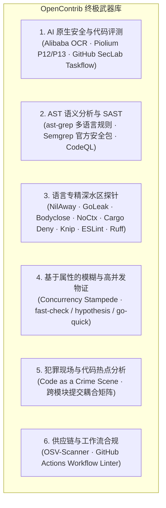

<div align="center">

# 🚀 OpenContrib

**Agent 原生的开源贡献工业级引擎**

[](https://opensource.org/licenses/MIT)
[](https://bun.sh)
[](https://www.typescriptlang.org/)
[](https://github.com/MeiSiristhebest/opencontrib)
[](https://github.com/MeiSiristhebest/opencontrib/blob/main/README_zh.md#-%E5%AD%90%E5%91%BD%E4%BB%A4%E5%85%A8%E6%99%AF%E6%8B%93%E6%89%91)
[](https://www.npmjs.com/package/opencontrib-cli)
[](#)

<p align="center">
  <b>[ <a href="./README.md">English</a> | 简体中文 ]</b>
</p>

<p align="center">
  <b>为自主编程 AI Agent（如 Google Antigravity、Claude Code、Cursor、Devin 等）量身打造的开源贡献基础设施：提供 6 维深水区武器库探针、Smart Pointer 渐进式切片解引用、Worktree 沙盒隔离、并发抢占风暴物证校验、反 AI 噪音治理门禁、持久化会话状态与贡献飞轮。</b>
</p>

</div>

---

## 💡 什么是 OpenContrib？

OpenContrib 是一套**贡献引擎（Contribution Engine）**，而非一个简单的聊天机器人或庞大的单体 Agent。它不试图替代 Claude Code、Cursor、Codex、Devin 或 Google Antigravity 的通用推理能力，而是**为推理大脑提供一套结构化、可复用、确定性的深水区工程武器库与贡献原语**。

```text
    ┌──────────────────────────────────────────────────────────────────┐
    │              外部 AI Agent（决策与推理大脑）                     │
    │    Google Antigravity · Claude Code · Cursor · Codex · Devin     │
    │                                                                  │
    │  自主逻辑推理 · 架构决策 · 代码编写 · 人机对齐                    │
    └───────────────────────────┬──────────────────────────────────────┘
                                │ Shell / CLI 调用
                                ▼
    ┌──────────────────────────────────────────────────────────────────┐
    │                 OpenContrib CLI（轻量级工具层）                   │
    │                                                                  │
    │  probe · pointer · capability · evidence · workspace · plugin    │
    │  governance · discovery · run · flywheel · doctor                │
    └───────────────────────────┬──────────────────────────────────────┘
                                │ 纯 TypeScript 类型引入
                                ▼
    ┌──────────────────────────────────────────────────────────────────┐
    │                @opencontrib/core（领域微内核）                   │
    │                                                                  │
    │  13 个纯领域模块 · 0 MCP 强依赖 · 0 CLI 框架强依赖               │
    │  Probe · Sandbox · Evidence · Governance · Flywheel · Run        │
    │  Storage · GitHub · Risk · Orchestration · LLM · Memory · Kernel │
    └──────────────────────────────────────────────────────────────────┘
```

**核心架构不变式**：`packages/core/` 对上层接口完全解耦。CLI（`opencontrib-cli`）作为无摩擦的第一类公民接口；同时提供标准 MCP 服务（`opencontrib-mcp`）以无缝接入 MCP 原生 Agent。

---

## ⚡ 快速开始

### 全局安装

```bash
# 通过 npm 全局安装 CLI
npm install -g opencontrib-cli

# 运行环境自检（检查宿主已安装的 SAST 探针与工具链）
opencontrib doctor --pretty
```

### 源码运行与本地开发

```bash
git clone https://github.com/MeiSiristhebest/opencontrib.git
cd opencontrib
bun install

# 运行全量测试矩阵（29 个测试套件，134 个用例，908 个断言，100% 通过）
bun test

# 静态类型检查（0 错误）
bun x tsc --noEmit
```

---

## 🗺️ 子命令全景拓扑

涵盖 10 大核心能力域的 24 个子命令：

| 领域 | 核心子命令 | 功能说明 |
| :--- | :--- | :--- |
| **Probe（探针）** | `probe run` `probe plan` `probe hotspot` `probe fuzz` | Top-K 聚合多探针扫描、代码热点分析、属性模糊测试脚手架 |
| **Pointer（智能指针）**| `pointer resolve` `pointer list` | 3 级渐进式切片解引用（`ptr://...` $\rightarrow$ 摘要、代码切片、完整证据） |
| **Capability（微内核）**| `capability list` `capability route` `capability score` | 动态能力路由与多维置信度打分 |
| **Evidence（物证）** | `evidence` | 并发抢占风暴混沌验证、延迟抖动与双阶段红绿断言物证收集 |
| **Workspace（沙盒）**| `workspace prepare` `workspace purge` | Git Worktree 物理隔离沙盒创建与临时环境安全销毁 |
| **Governance（治理）**| `governance audit` `governance impact` `governance ci-diagnose` `governance pr-template` | RFC-100 行限制审计、反 AI 噪音检测、姊妹模块变种排查、原生 PR 模板合并 |
| **Discovery（发现）** | `scout` `discovery rank` `discovery qualify` `discovery feasibility` `discovery context` `discovery manifests` | 机会多信号发现、防抢占资格判定、跨文件上下文智能打包 |
| **Plugin（插件）** | `plugin list` `plugin add` `plugin remove` | SAST/AST 插件热插拔与探针清单管理 |
| **Run（会话）** | `run create` `run get` `run resume` `run save` | 在 `~/.opencontrib/runs/` 下持久化完整的可审计贡献流水线状态 |
| **Flywheel（飞轮）** | `flywheel sync` `flywheel pr-track` `doctor` | 仓库画像沉淀、长期维护者信任飞轮、环境依赖诊断 |

---

## 🗡️ 6 维深水区武器库

OpenContrib 开箱集成了 6 大维度的专业分析武器：



### 🎯 Top-K 智能指针收敛与 1-Click 切片读取

执行 `opencontrib probe run` 时，系统会自动按照 `危害等级 x 类别权重 x 置信度` 进行高阶聚合，**默认只输出最具真实利用价值的 Top 5 缺陷候选**，并在每条下方附带一键解引用指令，彻底避免海量日志淹没上下文：

```bash
# 运行探针扫描，自动获得 Top-K 聚合摘要
opencontrib probe run ./target-repo --pretty

# 秒级读取 150-token 黄金代码切片（零多余上下文污染）
opencontrib pointer resolve ptr://findings/ast-ts-unhandled-promise-catch-foo-108 --view slice
```

---

## 🔄 双轨执行工作流

```text
Track A: 主动 0-Day 扫描模式（Proactive 0-Day Scanner）
  多维探针扫描 → Top-K 智能指针解引用 → Worktree 沙盒隔离 → 构造 Red 失败用例 → Green 最小化补丁
  → 20 轮并发抢占物证收集 → 姊妹模块变种猎杀排查 → Issue-First 声明登记 → 提交合入 PR

Track B: 被动 Issue 猎取模式（Reactive Issue Scout）
  多源检索 Issue → 多维信号打分 → 防抢占排他性甄别 → 环境可行性评估 
  → 跨文件上下文打包 → 沙盒验证修复 → 双阶段经验物证 → 治理审计门禁 → 提交合入 PR
```

---

## 🛡️ 5 大绝对工程防线（零容忍红线）

1. **防脱轨熔断机制（严禁超过 3 次盲目 view_file）**：
   - 杜绝连续盲看文件。定位代码必须通过 Smart Pointer 切片（`ptr://...`）或 `grep_search` 精准查找。
2. **0-Day 漏洞 Issue-First 铁律（严禁裸提 PR）**：
   - 对于主动挖掘的缺陷，**必须先创建带有 Claim 认领声明的 GitHub Issue**（`gh issue create --body-file ...`），并在随后的 PR 中强绑定 `Fixes #<id>`。
3. **单测子包精准隔离（严禁全仓盲跑 Flaky 测试）**：
   - 严禁在仓库根目录下运行宽泛的全局测试（如 `go test ./...` 或 `npm test`）。测试必须严格限定在修改的最小子包路径内。
4. **终端防卡死路径规约**：
   - 执行 `rg` 或 `fd` 搜索时**必须显式提供搜索目标目录**（如 `rg "pattern" .`），严禁缺省路径导致 stdin 永久阻塞。
5. **GitHub CLI 本地 Markdown 规约**：
   - Issue 与 PR 正文必须先写入本地 `.md` 文件并使用 `--body-file <file>` 传入，杜绝 PowerShell 转义字符导致的乱码或中断。

---

## 📦 Monorepo 模块架构

| 模块包 | npm 发布名 | 职能描述 |
| :--- | :--- | :--- |
| `@opencontrib/core` | — | 纯领域微内核 —— 13 个领域模块，29 个测试套件，0 外部接口依赖 |
| `opencontrib-cli` | `npm install -g opencontrib-cli` | CLI 命令行接口 —— 24 个子命令（基于 Commander.js） |
| `opencontrib-mcp` | `npm install opencontrib-mcp` | MCP 协议适配器 —— 20 个工具、3 个资源、1 个工作流 Prompt |
| `opencontrib-studio`| — | 本地 Web 可视化工作台与贡献生命周期看板 |

---

## 📜 开源协议

本项目采用 [MIT License](LICENSE) 许可协议。Copyright (c) 2026 OpenContrib 贡献者。
