# OpenContrib Autonomous Contribution Engine

OpenContrib is a deterministic, 9-phase contribution engine for open-source software. It orchestrates autonomous discovery, empirical reproduction, surgical remediation, and RFC-100 governance to produce high-impact, maintainer-welcomed contributions.

---

## 🧭 Dual-Track Execution Routing

When an open-source task begins, identify the track and load the corresponding reference guide:

| Track | Scenario & Trigger Context | Primary Reference |
| :--- | :--- | :--- |
| **Track A: Proactive 0-Day Scanner** | User requests code audit, bug hunting, 0-day discovery, or proactive contribution | Load [`references/workflow.md`](./references/workflow.md) |
| **Track B: Reactive Issue Scouting** | User wants to scout open issues, pick a good first issue, or fix an existing bug | Load [`references/discovery.md`](./references/discovery.md) |

---

## ⚡ High-Level 9-Phase Lifecycle

```mermaid
graph LR
    P1["1. Initialize"] --> P2["2. Probe (A) or Scout (B)"]
    P2 --> P3["3. Assemble Context"]
    P3 --> P4["4. Prepare Workspace"]
    P4 --> P5["5. Fail-First PoC & Fix"]
    P5 --> P6["6. Collect Evidence"]
    P6 --> P7["7. Governance Audit"]
    P7 --> P8["8. Issue-First & PR"]
    P8 --> P9["9. Flywheel Sync"]
```

---

## 📚 Progressive Disclosure Index

Load these modular references into context **only when entering that specific phase**:

- **Phase 2 & 3 (Scouting & Context):** Read [`references/discovery.md`](./references/discovery.md) for qualification filters, scoring heuristics, and context bundling.
- **Phase 2 (Deep SAST & AST Probes):** Read [`references/probe.md`](./references/probe.md) for Smart Pointer (`ptr://...`) slicing, Semgrep packs, and Tree-sitter AST queries.
- **Phase 4 (Workspace Sandbox):** Read [`references/workspace.md`](./references/workspace.md) for git worktree isolation and environment sanitization.
- **Phase 5 & 6 (Empirical Verification):** Read [`references/evidence.md`](./references/evidence.md) for fail-first baseline assertions and targeted verification (use stress loops only when testing concurrency or race conditions).
- **Phase 7 & 8 (Governance & Pull Requests):** Read [`references/governance.md`](./references/governance.md) for anti-AI linting, RFC-100 diff constraints, and native PR template merging.
- **Phase 9 (Memory & Profile):** Read [`references/flywheel.md`](./references/flywheel.md) for ledger synchronization.

---

## 🚫 The 9 Absolute Hard Invariants (Zero Tolerance)

1. **CLI-First Execution Priority (Dual-Ingress Architecture)**:
   - **CLI-First Priority**: Always prioritize executing `opencontrib <subcommand>` via terminal commands (`run_command`). The CLI provides automated active session inheritance, immediate log streaming, and deterministic `▶ NEXT RECOMMENDED COMMAND` prompts.
   - **MCP First-Class Support**: The OpenContrib MCP Server (`@opencontrib/mcp`) provides 34 composable JSON-RPC tools and resources when operating in MCP-only client environments.

2. **File-First Markdown Protocol (No Inline String Markdown)**:
   - **NEVER** pass Markdown, multi-line text, or quotes as inline string arguments in CLI/PowerShell (e.g. `-f body="..."` or `--body "..."`).
   - **ALWAYS** write content to a temporary UTF-8 file (`comment.json`, `pr_body.md`, `issue_body.md`) and pass `--body-file <file>` or `--input-file <file>`. This 100% eliminates quote stripping, encoding damage, and shell escaping traps.

3. **Single-Defect Atomic Focus (RFC-100 Surgical Constraint)**:
   - Every contribution run MUST address strictly **ONE single atomic defect**.
   - NEVER bundle multiple unrelated bugs or refactorings into one PR.
   - Diff size MUST be kept minimal and targeted ($\le 30-50$ lines). If multiple defects are discovered, triage them into separate distinct runs.

4. **Community Gate Ingestion & Hard Pause Protocol**:
   - Always run `opencontrib governance gate` to inspect repository guidelines (`CONTRIBUTING.md`).
   - If the community enforces an auto-close gate or requires maintainer approval (`lgtmi` / reopen) before PR submission, **PAUSE the pipeline immediately at Phase 8 after opening the Issue**. Do NOT open a PR until maintainer expresses explicit interest.

5. **Deterministic Guidance & Next-Command Obedience**:
   - Every `opencontrib` command prints a structured terminal guidance block containing `📍 PHASE`, `🚦 STATUS`, and `▶ NEXT RECOMMENDED COMMAND`.
   - **ALWAYS execute the `NEXT RECOMMENDED COMMAND` indicated in the CLI output.** Do NOT skip phases or jump ahead.
   - If `governance audit` exits with code `2` (GATED_BLOCKED), you are **HARD-BLOCKED** from creating a PR until the code quality rubric reaches $\ge 90\%$.

6. **Anti-Drift Circuit Breaker (Max 3 `view_file` calls)**:
   - **NEVER** perform blind sequential file reads (> 3 views).
   - Pinpoint symbols strictly via Smart Pointer slices (`ptr://...`) or `grep_search`. If you find yourself viewing files more than 3 times without progress, **execute `opencontrib probe run` immediately**.

7. **Mandatory Issue-First on 0-Days (No Blind PRs)**:
   - For proactive 0-day fixes, **ALWAYS create a GitHub Issue first** (`gh issue create --body-file ...`) with an authoritative Claim statement.
   - The subsequent PR description **MUST anchor `Fixes #<issue_number>`**. Unlinked PRs are strictly rejected.

8. **Targeted Subsystem Test Isolation (No Global Flaky Runs)**:
   - **NEVER** run broad root tests (`go test ./...` or `npm test` at repo root) without isolation.
   - Always scope test commands strictly to the modified sub-package (e.g. `bun test ./packages/ai/test/...`).

9. **PR Accompanying Test Coverage ($\ge 85\%$ on Modified Code)**:
   - Every submitted PR **MUST include comprehensive regression/unit tests** covering the modified target code.
   - Accompanying tests must achieve **$\ge 85\%$ statement, branch, and line coverage** on the modified logic (covering main paths, edge cases, and error branches). PRs with absent or superficial tests are strictly blocked at Phase 7 Governance Audit.

---

## 🎯 The Three Human Checkpoints

Pause and obtain user confirmation at these three gates:
- **Checkpoint 1 (Post-Scout / Finding Selection):** Present the **Single Defect Summary Card** (`printDefectCard`) with file path, line numbers, core defect in plain language, and minimal fix scope before preparing workspaces.
- **Checkpoint 2 (Empirical Reproduction):** Present the concrete failing test output proving the bug exists (`opencontrib evidence`) before modifying source code.
- **Checkpoint 3 (Governance & Pre-Flight Review):** Show the patch diff, governance audit score (0-100), and draft PR body before pushing to remotes.

