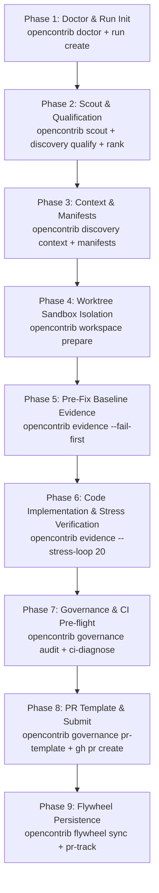

# OpenContrib CLI — Phase-Gated Contribution Protocol

> **Core Philosophy**: Open source contribution is not indiscriminate code generation — it is producing high-signal, empirically verified patches that maintainers want to merge.
>
> This skill enforces a **strict Phase-Gated State Machine**. Each phase MUST be executed via the corresponding `opencontrib` CLI command to produce structured JSON evidence BEFORE the next phase can begin. Skipping phases or executing ad-hoc scripts without CLI checkpoints is a **FATAL PROTOCOL VIOLATION**.

---

## 💎 Core Governance & Engineering Rules (核心工程准则)

### 🚨 Rule 1: Repository Convention Absolute Priority (仓库规范优先)
- ALWAYS prioritize the target repository's established style guides, commit conventions, PR templates, and workflow rules.
- If a repo requires specific ticket prefixes, custom PR section headers, DCO trailers, or mandatory issue linking formats, enforce them strictly over defaults.

### 🤫 Rule 2: Zero AI Disclosure by Default (默认隐藏 AI 痕迹)
- **Default Policy**: **DO NOT include any AI badges, LLM disclaimers, or assistant chatter** in PR descriptions or commit messages. Explicit AI mentions trigger maintainer bias and lead to immediate PR rejection.
- **Exception Policy**: Include AI disclosure **ONLY if the target repository's official documentation (`CONTRIBUTING.md`, `GOVERNANCE.md`, `SECURITY.md`, or PR template) explicitly mandates it**.

### 🛡️ Rule 3: 100-Line Size Gate & RFC Defense (100 行规模红线)
- Proposed code changes MUST NOT exceed **100 lines** (excluding tests).
- If an architectural change or public API modification is required, STOP and advise the user to submit an **RFC / Discussion Issue** first.

### 🚫 Rule 4: Anti-Farming & Low-SNR Ban (坚决杜绝低信噪比刷分)
- **Strictly Banned**: Typo fixes, whitespace tweaks, formatting rewrites, docstring rephrasing, or Awesome list submissions. These trigger anti-farming algorithm alarms and maintainer hostility.

### 🌊 Rule 5: Focus on the 8 Deep-Water Defect Archetypes (八大深水区高价值缺陷全景图谱)
Target issues matching these 8 high-signal categories:
1. **Protocol & Serialization Drift (协议与序列化契约漂移)**: Zero-Value in `omitempty` erased causing downstream default value penetration; HTTP/2 header casing; SSE keepalive and half-closed connections.
2. **Lifecycle, Watcher & Resource Leaks (生命周期与资源泄露)**: Registry watcher reconnect loop doubling listeners; Context Cancellation unpropagated causing orphan goroutines; unclosed fd / socket handle leaks (`lsof`).
3. **Distributed Cache & Consistency (分布式缓存与时序一致性)**: Falsy value cache bypass in short cache; out-of-order dual write cache stampede; retry mechanisms breaking idempotency.
4. **Memory Layout & Underlying ABI (内存布局与底层 ABI)**: Non-contiguous / strided tensor (`permute`/`transpose`) passed to C++/CUDA kernel causing Segfault; FFI cross-language dangling pointers.
5. **Performance Collapse & Backpressure Loss (性能坍塌与反压失效)**: Catastrophic regex backtracking (ReDoS) hanging CPU at 100%; missing Full Jitter exponential backoff causing thundering herds; unbounded queues causing OOM.
6. **Time Monotonicity & Chrono Hazards (时间单调性与时钟回拨)**: Wall Clock elapsed time calculation yielding negative values under NTP sync; DST / leap second skipping scheduled tasks.
7. **Compiler / JIT Escape Analysis Invariants (逃逸分析与 GC 停顿)**: Hot-path dynamic interface assertions breaking escape analysis causing heap allocation explosions and GC STW spikes.
8. **Numerical Bounds & Cross-Platform Invariants (数值边界与跨平台破坏)**: `NaN`/`+Inf` and negative timeout values causing scheduler lockup; Windows/Linux CRLF breaking patch parsers; `filepath.ToSlash` cross-platform path traversal vulnerabilities.

---

## 🔄 9-Phase Mandatory Execution State Machine (9 阶段状态机)



---

## 🛠️ Phase-by-Phase CLI Execution Commands

### Phase 1: Environment Health & Run Session Initialization

```bash
# 1. Verify host environment (Git, Node/Bun, Docker, WSL, Ledger Storage)
opencontrib doctor

# 2. Initialize an auditable contribution run session
opencontrib run create \
  --repo <owner/repo> \
  --issue <issue_number> \
  --title "<issue_title>" \
  --tags "bugfix,deep-water"
# → Note the returned `runId` (e.g. run-1787...)
```

---

### Phase 2: Opportunity Scouting, Qualification & 8-Defect Ranking

```bash
# 1. Scout unclaimed, high-value opportunities
opencontrib scout <owner/repo> --limit 10

# 2. Author-first-right & anti-bandwagoning qualification check
printf '{"issue":{"number":<issue_num>,"title":"<title>","comments_count":<count>,"labels":[]}}' | \
  opencontrib discovery qualify

# 3. 8-Dimension deep-water probability ranking
opencontrib discovery rank --input '{"issue":{"number":<issue_num>,"title":"<title>","body":"..."}}'
```
*Gate Condition*: If qualification fails (e.g., maintainer already assigned, author claims first-right, or score < 0.65), STOP and select another opportunity.

---

### Phase 3: Context Assembly & Manifest Diagnosis

```bash
# 1. Assemble multi-dimensional problem context and test targets
opencontrib discovery context --input '{"repo":"<owner/repo>","issueNumber":<num>,"issueTitle":"...","issueBody":"..."}'

# 2. Diagnose repo manifests (package.json, pyproject, go.mod, workflows) for ≤100-line improvements
opencontrib discovery manifests --repo-path <path_to_repo>

# 3. Assess toolchain execution feasibility (OS, Node/Go/Python versions)
opencontrib discovery feasibility --title "<issue_title>" --labels "<labels_json>"
```

---

### Phase 4: Worktree Sandbox Isolation

**NEVER modify code directly in the main checkout.** Always isolate changes in a dedicated Git worktree:

```bash
opencontrib workspace prepare \
  --repo <owner/repo> \
  --issue <issue_number> \
  --run-id "$RUN_ID"
# → Captures `workspacePath` (e.g. ~/.opencontrib/workspaces/owner-repo-issue-42)
```

---

### Phase 5: Dual-Stage Empirical Verification (Fail-First Baseline)

Before writing the fix, you MUST prove the bug exists with a reproducible failing test:

```bash
# Execute pre-fix test assertion: MUST fail before the fix
opencontrib evidence \
  --cwd "$WORKSPACE_PATH" \
  --test-cmd "<test_command_e.g._npm_test_or_pytest>" \
  --assertion "<expected_failure_pattern>" \
  --run-id "$RUN_ID"
```

---

### Phase 6: Code Implementation & Post-Fix Stress Loop

1. Implement minimal, surgical changes in `$WORKSPACE_PATH` (strictly ≤ 100 lines).
2. Execute post-fix stress loop verification (ensure 100% pass rate with 0 flakes):

```bash
# Stress-test the patch across 20 iterations
opencontrib evidence \
  --cwd "$WORKSPACE_PATH" \
  --test-cmd "<test_command>" \
  --stress-loop 20 \
  --run-id "$RUN_ID"
```

---

### Phase 7: Governance Audit, Impact Analysis & CI Pre-Flight

```bash
# 1. Run strict governance & size audit
git -C "$WORKSPACE_PATH" diff | \
  opencontrib governance audit \
    --patch /dev/stdin \
    --pr-title "<proposed_pr_title>" \
    --pr-body "<proposed_pr_body>"

# 2. Analyze impact surface (exported API symbols, breaking change risk)
opencontrib governance impact \
  --cwd "$WORKSPACE_PATH" \
  --modified-files "<comma_separated_files>"

# 3. Simulate and diagnose CI log health
opencontrib governance ci-diagnose --log-file <path_to_ci_or_test_log>
```
*Gate Condition*: `governance audit` MUST output `"status": "PASSED"`. If warnings exist (e.g., >100 lines, AI fluff detected, missing test evidence), resolve them immediately.

---

### Phase 8: PR Template Rendering & Submission

```bash
# 1. Render clean, maintainer-friendly PR description (no AI fluff)
opencontrib governance pr-template \
  --issue <issue_number> \
  --issue-title "<issue_title>" \
  --summary "<concise_technical_summary>" \
  --validation-cmd "<test_command>" \
  --validation-output "20/20 stress tests passed, 0 flakes" \
  --key-changes "<change_1>,<change_2>" \
  | jq -r '.prBody' > pr_body.md

# 2. Push branch and create PR via GitHub CLI
git -C "$WORKSPACE_PATH" checkout -b fix/<short_issue_topic>
git -C "$WORKSPACE_PATH" add <files>
git -C "$WORKSPACE_PATH" commit -m "fix(<scope>): <concise_description> (#<issue_number>)"
git -C "$WORKSPACE_PATH" push -u origin fix/<short_issue_topic>

gh pr create \
  --repo <owner/repo> \
  --title "fix(<scope>): <concise_description> (#<issue_number>)" \
  --body-file pr_body.md \
  --head fix/<short_issue_topic>
```

---

### Phase 9: Profile Flywheel Persistence & Lifecycle Tracking

```bash
# 1. Sync verified contribution into the developer's OpenContrib Ledger & Flywheel
opencontrib flywheel sync \
  --run-id "$RUN_ID" \
  --pr-url "<pr_html_url>"

# 2. Track PR merge status and maintainer comments
opencontrib flywheel pr-track --repo <owner/repo> --pr-number <pr_number>
```

---

## ⚡ Agent Quick Troubleshooting

| Failure Symptom | Cause | CLI Remedy |
| :--- | :--- | :--- |
| `Git is not installed or not in PATH` | Doctor health check failed | Run `opencontrib doctor` to inspect missing toolchains. |
| `author-first-right violation` | Issue author explicitly said "I will submit a PR" | `opencontrib discovery qualify` outputs rejection; pick next issue. |
| `Score < 0.65` | Low-value typo/comment issue | `opencontrib discovery rank` penalizes; reject farming attempt. |
| `Audit FAILED: Diff exceeds 100 lines` | Patch is too invasive | Scope down the patch or propose an RFC Discussion first. |
| `CI diagnosis detects Flaky Test` | Race condition in test case | Run `opencontrib evidence --stress-loop 20` to verify determinism. |
