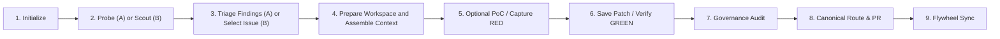

# OpenContrib Autonomous Contribution Engine

OpenContrib is a deterministic, 9-phase contribution engine for open-source software. It orchestrates autonomous discovery, empirical reproduction, surgical remediation, and RFC-100 governance to produce high-impact, maintainer-welcomed contributions.

---

## 🧭 Dual-Track Execution Routing

When an open-source task begins, identify the track and load the corresponding reference guide:

| Track                                | Scenario & Trigger Context                                                        | Primary Reference                                           |
| :----------------------------------- | :-------------------------------------------------------------------------------- | :---------------------------------------------------------- |
| **Track A: Proactive 0-Day Scanner** | User requests code audit, bug hunting, 0-day discovery, or proactive contribution | Load [`references/workflow.md`](./references/workflow.md)   |
| **Track B: Reactive Issue Scouting** | User wants to scout open issues, pick a good first issue, or fix an existing bug  | Load [`references/discovery.md`](./references/discovery.md) |

---

## ⚡ High-Level 9-Phase Lifecycle

```mermaid
graph LR
    P1["1. Initialize"] --> P2["2. Probe (A) or Scout (B)"]
    P2 --> P3["3. Triage Findings (A) or Select Issue (B)"]
    P3 --> P4["4. Prepare Workspace and Assemble Context"]
    P4 --> P5["5. Optional PoC / Capture RED"]
    P5 --> P6["6. Save Patch / Verify GREEN"]
    P6 --> P7["7. Governance Audit"]
    P7 --> P8["8. Canonical Route & PR"]
    P8 --> P9["9. Flywheel Sync"]
```

---

## 📚 Progressive Disclosure Index

Load these modular references into context **only when entering that specific phase**:

- **Phase 2 (Scouting & Probing):** Read [`references/discovery.md`](./references/discovery.md) for qualification filters and scoring; read [`references/probe.md`](./references/probe.md) for Deep SAST and AST probes.
- **Phase 3 (Pointer Navigation):** Read [`references/probe.md`](./references/probe.md) for Smart Pointer (`ptr://...`) slicing and finding triage.
- **Phase 4 (Workspace & Context):** Read [`references/workspace.md`](./references/workspace.md) for git worktree isolation and environment sanitization; read [`references/discovery.md`](./references/discovery.md) for context bundling.
- **Phase 5 & 6 (Empirical Verification):** Read [`references/evidence.md`](./references/evidence.md) for fail-first baseline assertions and targeted verification (use stress loops only when testing concurrency or race conditions).
- **Phase 7 & 8 (Governance & Pull Requests):** Read [`references/governance.md`](./references/governance.md) for anti-AI linting, RFC-100 diff constraints, and native PR template merging.
- **Phase 9 (Memory & Profile):** Read [`references/flywheel.md`](./references/flywheel.md) for ledger synchronization.

---

## 🚫 The 9 Absolute Hard Invariants (Zero Tolerance)

1. **CLI-First Execution Priority (Dual-Ingress Architecture)**:
   - **CLI-First Priority**: Always create the tracked run with `opencontrib run create` before executing any other lifecycle command, then prioritize executing `opencontrib <subcommand>` via terminal commands (`run_command`). The CLI provides automated active session inheritance, immediate log streaming, and deterministic `▶ NEXT RECOMMENDED COMMAND` prompts.
   - **MCP First-Class Support**: The OpenContrib MCP Server (`@opencontrib/mcp`) provides 39 composable JSON-RPC tools and resources when operating in MCP-only client environments.

2. **File-First Markdown Protocol (No Inline String Markdown)**:
   - **NEVER** pass Markdown, multi-line text, or quotes as inline string arguments in CLI/PowerShell (e.g. `-f body="..."` or `--body "..."`).
   - **ALWAYS** write content to a temporary UTF-8 file (`comment.json`, `pr_body.md`, `issue_body.md`) and pass `--body-file <file>` or `--input-file <file>`. This 100% eliminates quote stripping, encoding damage, and shell escaping traps.

3. **Single-Defect Atomic Focus (RFC-100 Surgical Constraint)**:
   - Every contribution run MUST address strictly **ONE single atomic defect**.
   - NEVER bundle multiple unrelated bugs or refactorings into one PR.
   - Diff size MUST be kept minimal and targeted ($\le 30-50$ lines). If multiple defects are discovered, triage them into separate distinct runs.

4. **Community Gate Ingestion & Hard Pause Protocol**:
   - Always run `opencontrib governance gate` to inspect repository guidelines (`CONTRIBUTING.md`).
   - If the community enforces an auto-close gate or requires maintainer approval (`lgtmi` / reopen) before PR submission, **PAUSE the pipeline immediately at Phase 8 after opening the Issue**. Do NOT open a PR until maintainer expresses explicit interest.

5. **Deterministic Guidance & Next-Command Obedience**:
   - Every `opencontrib` command prints a structured terminal guidance block containing `📍 PHASE`, `🚦 STATUS`, and `▶ NEXT RECOMMENDED COMMAND`.
   - **ALWAYS execute the `NEXT RECOMMENDED COMMAND` indicated in the CLI output.** Do NOT skip phases or jump ahead.
   - If `governance audit` exits with code `2` (GATED_BLOCKED), you are **HARD-BLOCKED** from creating a PR until the code quality rubric reaches $\ge 90\%$.

6. **Anti-Drift Circuit Breaker (Max 3 `view_file` calls)**:
   - **NEVER** perform blind sequential file reads (> 3 views).
   - Pinpoint symbols strictly via Smart Pointer slices (`ptr://...`) or `grep_search`. If you find yourself viewing files more than 3 times without progress, **execute `opencontrib probe run` immediately**.

7. **Canonical Submission Route (No Blind PRs)**:
   - Public 0-day fixes require a provider-created or provider-re-read `IssueBindingArtifact` sealed to the run.
   - Private vulnerability fixes require a provider-verified `SecurityDisclosureArtifact` and lifecycle authorization; they must not create a public Issue.
   - Public PR descriptions may reference only the canonical Issue ID from the binding. Caller-supplied Issue numbers are not authoritative.

8. **Targeted Subsystem Test Isolation (No Global Flaky Runs)**:
   - **NEVER** run broad root tests (`go test ./...` or `npm test` at repo root) without isolation.
   - Always scope test commands strictly to the modified sub-package (e.g. `bun test ./packages/ai/test/...`).

9. **Repository Coverage Policy**:
   - Every submitted PR **MUST include comprehensive regression/unit tests** covering the modified target code.
   - The trusted repository policy controls `coverage.required` and `minimumChangedLineCoverage`. GREEN measures changed source lines with native `bun test --coverage --coverage-reporter=lcov`. CLI `--coverage-report` / MCP `coverageReport` must select the LCOV produced at that invocation's `--coverage-dir`. Required coverage blocks unsupported instrumenters and missing, incomplete, malformed, stale, or below-threshold reports. The default policy makes coverage advisory; it does not promise statement or branch coverage for every language.

---

## 🎯 The Three Human Checkpoints

Pause and obtain user confirmation at these three gates:

- **Checkpoint 1 (Post-Scout / Finding Selection):** Present the **Single Defect Summary Card** (`printDefectCard`) with file path, line numbers, core defect in plain language, and minimal fix scope before preparing workspaces.
- **Checkpoint 2 (Empirical Reproduction):** Capture the RED baseline with `opencontrib evidence capture-red --test-cmd "<cmd>" --assertion "<pattern>"` and present the concrete failing test output proving the bug exists **before** modifying source code. After the fix, verify with `opencontrib evidence verify-green --test-cmd "<cmd>"` (a passing test alone is insufficient — a captured RED baseline is required).
- **Checkpoint 3 (Governance & Pre-Flight Review):** Show the patch diff, governance audit score (0-100), and draft PR body before pushing to remotes.

<!-- OPENCONTRIB:GENERATED protocol:start -->
## Canonical OpenContrib Protocol (generated)

- **Run anchor (first)**: `opencontrib run create --repo <owner/repo> [--issue <id>]` / `contrib_create_run`; no scouting, workspace preparation, or source edits before a runId exists.
- **Workspace and evidence**: `opencontrib workspace prepare --repo <owner/repo> --issue <issue-or-task-id>` / `contrib_prepare_workspace`; PoC (contrib_verify_poc) is optional and never replaces authoritative RED via contrib_capture_red.
- **Lifecycle order**: Run → scout/probe → workspace → context → RED → patch → GREEN → PR draft → governance → trusted approval → submission → flywheel. The canonical RunManager phase is the lifecycle; pipeline stage labels record execution progress only.
- **Coverage policy**: the trusted repository sets coverage.required and minimumChangedLineCoverage. GREEN measures changed source lines from native `bun test --coverage --coverage-reporter=lcov`; a custom LCOV path must match the runner's `--coverage-dir`. Unsupported instrumenters and missing, incomplete, stale or unusable reports are UNAVAILABLE and block required coverage. Whole-project summaries do not satisfy changed-line coverage. Unknown output scripts and any execution with zero observed tests block GREEN and governance.
- **Setup and deployment**: @opencontrib/mcp setup --all configures MCP clients; @opencontrib/cli setup checks the development toolchain. Provider-write credentials and approval keys belong only to the trusted broker. Physical isolation requires a separate worker with no host credentials or metadata access; unrestricted host shell access can bypass an in-process protocol gate.
- **RED → PATCH → GREEN**: run contrib_capture_red first, then save the patch through contrib_save_artifact, and verify GREEN through contrib_verify_green; PATCH_DRAFTED is invalid without RED.
- **Routing and governance**: public vulnerabilities require a provider-verified IssueBindingArtifact; private vulnerability policy requires a provider-verified SecurityDisclosureArtifact and public-fix authorization, with no public Issue route. Use a non-public task identifier when preparing a private-work workspace.
- **PR draft**: while still in EVIDENCE_COLLECTED, create and persist immutable pr_draft with opencontrib governance pr-template --run-id <run_id> --issue-title "<title>" --summary "
" / contrib_render_pr_template; private security drafts must omit public Issue references. Then run opencontrib governance audit --run-id <run_id> --pr-title "<title>" → opencontrib governance request-approval --run-id <run_id> → opencontrib submission submit; MCP order is contrib_render_pr_template → contrib_audit_governance → contrib_request_approval → contrib_submit_pr / SubmissionPort.
- Do not write Pull Requests through raw GitHub CLI, GitHub MCP, or GitHub API operations; they bypass SubmissionIntent, ApprovalArtifact, SubmissionPermit, and provider verification.
<!-- OPENCONTRIB:GENERATED protocol:end -->
